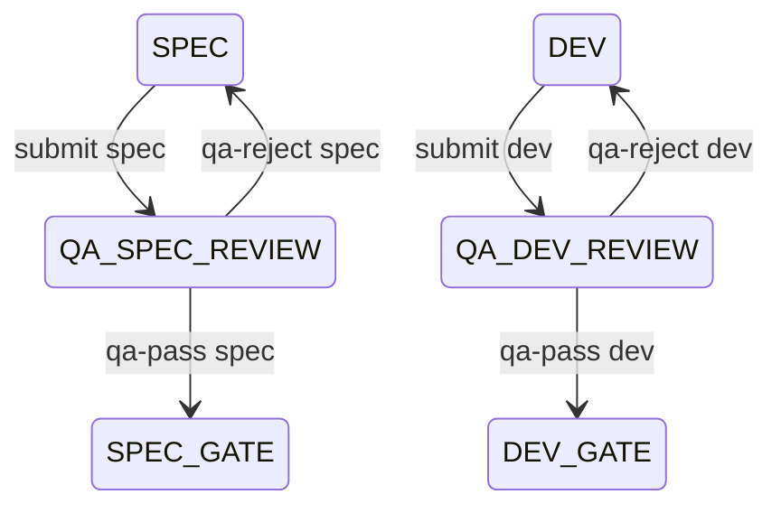

# Dev Team — State Machine

**Enforcement:** `scripts/dev_team_cli.py`. Every transition needs `"ok": true`.

## States

| State | Role | Description |
|-------|------|-------------|
| `IDLE` | — | No session |
| `TASK_SCOPING` | Orchestrator + human | `scope propose` → human → `scope confirm` |
| `RESEARCH` | Researcher | `research.md` |
| `RESEARCH_GATE` | — | Human gate |
| `SPEC` | PM | `spec.md` (+ allowlist) |
| `QA_SPEC_REVIEW` | QE | Spec standards review |
| `SPEC_GATE` | — | Human gate (after `qa-pass spec`) |
| `DEV` | Developer | Code + `dev-handoff.md` |
| `QA_DEV_REVIEW` | QE | Dev vs spec review |
| `DEV_GATE` | — | Human gate (after `qa-pass dev`) |
| `QA` | QE | Final `qa-report.md` |
| `QA_GATE` | — | Human ship gate |
| `DONE` / `ABORTED` | — | Terminal |

## Start modes

| Mode | First state | Notes |
|------|-------------|--------|
| `full` | `RESEARCH` | Default |
| `lite` | `SPEC` | User may inline spec; skips research work |
| `skip-research` | `SPEC` | Same as lite for entry state |
| `skip-to-dev` | `DEV` | Pre-flags spec QA passed; **human gates still required** |

Command: `start --mode <mode>`. Human `*_GATE` states are never skipped.

## QA loops (max 3 each)

After 3 failed cycles, CLI blocks submit — escalate to human (`revise` / `abort`).

## Artifacts

All under `.dev-team/works/<slug>/artifacts/`:

| File | Owner | When |
|------|-------|------|
| `research.md` | Researcher | RESEARCH |
| `spec.md` | PM | SPEC |
| `qa-spec-feedback.md` | QA | qa-reject spec |
| `dev-handoff.md` | Developer | DEV |
| `qa-dev-feedback.md` | QA | qa-reject dev |
| `qa-report.md` | QA | QA |

## State → allowed / forbidden

| State | Allowed | Forbidden |
|-------|---------|-----------|
| `TASK_SCOPING` | `scope propose`, collaborate | `scope confirm` without user yes; `start` |
| `RESEARCH` | `write research`, explore (read-only) | `write spec`, repo implementation |
| `RESEARCH_GATE` | wait; `approve research` after ack | `approve` without ack; jump to SPEC |
| `SPEC` | `write spec`, `submit spec` | repo edits outside artifacts |
| `QA_SPEC_REVIEW` | `validate`, `qa-pass` / `qa-reject` | `approve spec` |
| `SPEC_GATE` | `approve spec` after ack; `revise`/`reject` | `write spec` (frozen since qa-pass) |
| `DEV` | allowlisted repo edits, `submit dev` | `approve spec`; `reject to spec` (needs DEV_GATE) |
| `QA_DEV_REVIEW` | `qa-pass` / `qa-reject dev` | `approve dev` |
| `DEV_GATE` | `approve dev` after ack; `reject to spec` | `reject to spec` from DEV |
| `QA` | `write qa-report`, `submit qa` | skip to DONE without QA_GATE |
| `QA_GATE` | `approve qa` after ack; `reject to dev` | — |

## Human approve / reject matrix

| User says (at gate) | Required state | CLI (after hook ack) | → State |
|---------------------|----------------|----------------------|---------|
| `approve research`, `lgtm` | `RESEARCH_GATE` | `approve research` | `SPEC` |
| `approve spec`, `lgtm` | `SPEC_GATE` | `approve spec` | `DEV` |
| `approve dev`, `lgtm` | `DEV_GATE` | `approve dev` | `QA` |
| `approve qa`, `ship` | `QA_GATE` | `approve qa` | `DONE` |
| `revise spec: …` | `SPEC_GATE` | `revise spec` | `SPEC` |
| `reject to research` | `SPEC_GATE` | `reject research` | `RESEARCH` |
| `reject to spec` | `DEV_GATE` | `reject spec` | `SPEC` |
| `reject to dev` | `QA_GATE` | `reject dev` | `DEV` |
| `abort` | any active | `abort` | `ABORTED` |

## Forbidden transitions

- `SPEC` → `SPEC_GATE` without `QA_SPEC_REVIEW` + `qa-pass spec`
- `DEV` → `DEV_GATE` without `QA_DEV_REVIEW` + `qa-pass dev`
- `approve spec` without `qa-pass spec` and allowlist in spec
- `approve dev` without `qa-pass dev`
- More than 3 QA loops without human escalation
- Edit artifact after `qa-pass` without `revise` / `reject` back to work state

## CLI quick reference

| Event | Command |
|-------|---------|
| PM done | `submit spec` |
| QA pass spec | `qa-pass spec` |
| QA reject spec | `write-qa-feedback spec` + `qa-reject spec` |
| Human pass spec | `approve spec` |
| Dev done | `submit dev` |
| QA pass dev | `qa-pass dev` |
| QA reject dev | `write-qa-feedback dev` + `qa-reject dev` |
| Human pass dev | `approve dev` |

Full list: [cli-reference.md](cli-reference.md).
