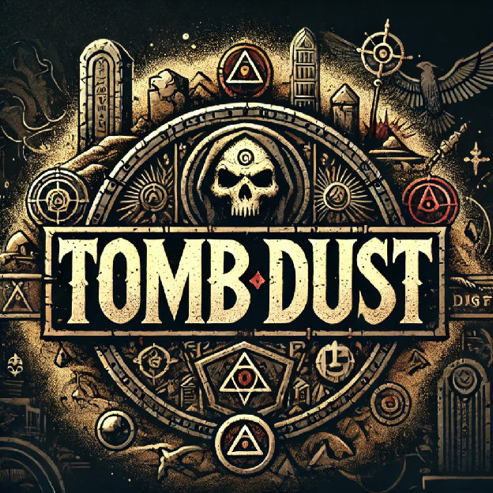

# Tomb Dust Game Systems

## Tomb Dust Game Systems

Modular documentation split from `Tomb Dust Game System.md`.

**Agents:** project rules → [AGENTS.md](../../AGENTS.md)

**Setting entry point:** [world/README.md](world/README.md) · **Map (source of truth):** [data/av-grid/av-grid.json](../data/av-grid/av-grid.json)

### Systems

- [character/](character/README.md)
- [classes/](classes/README.md)
- [combat/](combat/README.md)
- [magic/](magic/README.md)
- [core/](core/README.md)
- [deities/](deities/README.md)
- [equipment/](equipment/README.md)
- [events/](events/README.md)
- [factions/](factions/README.md)
- [locations/](locations/README.md)
- [lore/](lore/README.md)
- [monsters/](monsters/README.md)
- [npcs/](npcs/README.md)
- [races/](races/README.md)
- [skills/](skills/README.md)
- [world/](world/README.md) — Aventhar bible (regions, history, Ether, extraction)

### Dependency notes

- [character/races.md](character/races.md) — mechanical race adjustments
- [races/](races/) — lore and world role per race
- [core/resolution.md](core/resolution.md) — d20 tests, crits, Fortune, positioning
- [combat/calculations.md](combat/calculations.md) — PB, skill bonus, attacks, AC, Dodge
- [monsters/README.md](monsters/README.md) — threat tiers, stat blocks, 16 creatures
- [world/ether.md](world/ether.md) — Ether references across the setting
