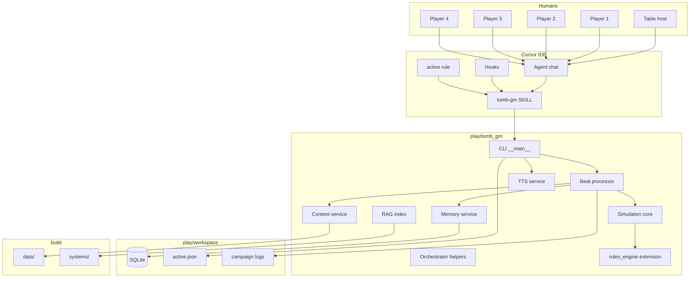

# Tomb Dust AI GM — full implementation specification

**Version:** 1.0 (2026-05-18)  
**Status:** Normative target for implementation  
**Companion:** [tomb-gm-build-roadmap.md](tomb-gm-build-roadmap.md) (section-by-section delivery order)

---

## 1. Purpose and scope

### 1.1 Purpose

This document specifies the **complete software implementation** of Tomb Dust as a **Cursor-hosted AI Game Master**: up to four human players experience a persistent tabletop campaign in Aventhar while a **Cursor agent** narrates, and a **deterministic Python engine** (`play/tomb_gm`) owns all mechanical and save-game state.

### 1.2 In scope

| Area | Requirement |
|------|-------------|
| **Play surface** | Cursor Agent chat; invoke `@tomb-gm` to start or continue |
| **Player UX** | Chat only (`[P1]`…`[P4]`, `[PARTY]`, `[OOC]`); no terminal, no file edits |
| **Agent UX** | Runs all CLI; never invents stats, AV-GRID, or HP |
| **World** | Full **AV-GRID** travel and exploration; hubs, wilderness, social play |
| **Delves** | Site graphs, extraction phases, threat clocks, Registry economy — **one mode among many** |
| **Characters** | Full creation per `build/systems/character/creation-steps.md`; deed progression |
| **Memory** | SQLite episodic + semantic + embeddings; seamless resume after weeks |
| **Voice** | edgeTTS via CLI `speak`; host PC audio |
| **Canon** | Read-only `build/` during play; version-pinned content |

### 1.3 Out of scope

- Discord / cloud multiplayer server
- 3D client, tactical grid UI, real-time action game loop
- Rewriting canon in `build/` during play sessions
- LLM as source of truth for numbers or coordinates
- Substituting hallucinated monster stats when JSON is missing

### 1.4 Success criteria (product)

A table can:

1. Invoke **`@tomb-gm`** with no prior setup commands.
2. Create campaigns and **four characters** through conversation.
3. **Explore Aventhar** (surface and layers) without entering a delve.
4. Run **delves** with correct clocks, stamps, and extract rules.
5. Fight combats with initiative, conditions, spells, Fortune, death rules.
6. End a session and **resume later** with recap, location, phase, and story facts intact.
7. Hear the GM via **edgeTTS** (optional `text_only` mode).
8. Never touch the CLI; state remains consistent across agent turns.

---

## 2. Repository architecture

### 2.1 Top-level split

```
ttTomb-Dust/
  build/                    # BUILD — authoritative game definition
    data/                   # JSON content (AV-GRID, monsters, …)
    systems/                # Rules & lore markdown
    tools/                  # validate_content, av_grid, rules_engine
    docs/                   # engine-integration, design
    backlog/ assets/ RULESCHANGELOG.md

  play/                     # PLAY — runtime only
    workspace/              # Saves (gitignored runtime under .local/)
    tomb_gm/                # Python engine + CLI
    docs/                   # This spec, roadmap, cursor-tomb-gm-spec

  .cursor/skills/tomb-gm/   # GM agent playbook
  .cursor/rules/            # tomb-gm-active, tomb-dust-project
  AGENTS.md                 # Rules for editing build/
  conftest.py               # pytest: build/ on sys.path
```

### 2.2 Path constants (code)

| Symbol | Path |
|--------|------|
| `REPO_ROOT` | Parent of `play/` |
| `BUILD_ROOT` | `REPO_ROOT/build` |
| `PLAY_ROOT` | `REPO_ROOT/play` |
| `DEFAULT_WORKSPACE` | `PLAY_ROOT/workspace` |
| `content_root` | From `workspace/config.yaml` → default `../../build` |

### 2.3 Write policy during play

| Path | Agent may write |
|------|-----------------|
| `play/workspace/` | Yes (via CLI only) |
| `play/tomb_gm/` | No (unless dev task) |
| `build/**` | No |

Hook `afterFileEdit` (optional): deny edits outside `play/workspace/` and `play/tomb_gm/tests/` when `play/workspace/.local/active.json` exists.

---

## 3. Runtime architecture

### 3.1 Component diagram



### 3.2 Authority hierarchy

1. **SQLite + CLI committed state** — highest for mechanics and saves  
2. **`build/data/*.json`** — world and stat blocks  
3. **`build/systems/**`** — rules prose; RAG retrieval  
4. **LLM narration** — fiction only; must match 1–3  
5. **Chat history** — not authoritative; recap from DB

### 3.3 Single entry: `@tomb-gm`

On every invoke, the agent **must** run (from repo root):

```powershell
python -m tomb_gm --workspace play/workspace status
python -m tomb_gm --workspace play/workspace check
python -m tomb_gm --workspace play/workspace suggest
```

Branch on `suggest.awaiting` (see §8.3). Never ask the host to run these manually during play.

---

## 4. User roles and interaction

### 4.1 Roles

| Role | Count | Interface |
|------|-------|-----------|
| Player | 1–4 | `[Pn Name] …` lines |
| Table host | 1 | Invokes `@tomb-gm`; may relay couch speech into `[Pn]` lines |
| GM agent | 1 per turn | Cursor Agent with tomb-gm skill |
| Subagents (optional) | 0–n | Rules Clerk, Chronicler — readonly or CLI-only |

### 4.2 Player input grammar

Lines are parsed before `beat`:

| Pattern | Meaning |
|---------|---------|
| `[P1]` … `[P4]` | Character action; optional name after slot |
| `[PARTY]` | Whole-party action |
| `[OOC]` … | Rules / meta question → may route to Rules Clerk |
| `[GM] pause` | Pause LLM processing (no state change) |
| `[GM] end session` | Maps to `session end` |
| `/sheet` | Shorthand for `character show` for speaker’s slot |

Unprefixed host lines during play: treat as OOC to GM unless session in `SETUP` mode.

### 4.3 Agent output format

Every agent reply during play **starts with** a session state block:

```markdown
---
**Campaign:** salt-road | **Session:** active
**Phase:** delve | **Mode:** site | **Location:** 32-C-UG-1 @ ossuary-hall
**Clock:** delve 2/6 | **Stamp:** REG-1172 / 32-C-UG-1
**Awaiting:** P2, P4 — actions | **Combat:** no
---
```

Then **narration** (markdown). Mechanical detail in a collapsible `<details>` section or footnote block with CLI JSON summary.

After narration, agent runs `speak` unless `config.tts.mode: text_only`.

---

## 5. Cursor integration

### 5.1 Skill: `.cursor/skills/tomb-gm/SKILL.md`

| Property | Value |
|----------|-------|
| `name` | `tomb-gm` |
| `disable-model-invocation` | **false** — user invokes to play |
| Mandatory reads | `orchestrator.md`, this spec §8 |

### 5.2 Rule: `.cursor/rules/tomb-gm-active.mdc`

`alwaysApply: true`. When `play/workspace/.local/active.json` exists:

1. Act as GM Orchestrator (read tomb-gm SKILL).  
2. Run `status` → `check` → `suggest` at start of every turn.  
3. If `check.blocked`, do not advance fiction until resolved.  
4. All state changes via `python -m tomb_gm` only.

### 5.3 Hooks: `.cursor/hooks/tomb_gm_*.py`

| Hook | Behavior |
|------|----------|
| `beforeSubmitPrompt` | If play active: append injected context (§7.4) from `status` + `recall --query <auto>` |
| `beforeShellExecution` | Allowlist: `python -m tomb_gm`, `edge-tts`, `mpv`/`ffplay`; deny `git` write to `build/` |
| `afterFileEdit` | Optional lock (§2.3) |

---

## 6. Package layout: `play/tomb_gm/`

```
play/tomb_gm/
  __init__.py
  __main__.py              # CLI entry
  config.py                # GameplayConfig (exists)
  cli/
    parser.py              # argparse tree
    output.py              # JSON stdout, exit codes
  db/
    connection.py
    migrations/            # 001_initial.sql, …
    schema.py
  domain/
    campaign.py
    session.py
    party.py
    character.py
    combat.py
    stamp.py
    clock.py
  services/
    content.py             # load JSON from build/data
    world.py               # AV-GRID travel
    site.py                # site graph
    simulation/
      checks.py
      combat.py
      spells.py
      extraction.py
    memory/
      episodic.py
      semantic.py
      embeddings.py
      compact.py
    rag/
      index.py
      search.py
    tts/
      edge.py
      cache.py
      player.py
    beat.py                # beat processor
  rules/
    bridge.py              # import build/tools/rules_engine
  suggest.py               # suggest engine
  gates.py                 # human gate registry
```

**Dependency rule:** `domain` does not import Cursor. `cli` calls `services`. `rules/bridge` adds `build/` to path for `tools.rules_engine`.

---

## 7. Configuration

### 7.1 `play/workspace/config.yaml`

```yaml
content_root: ../../build
workspace: .
local_dir: .local
max_players: 4

content_pin:                  # set on campaign new
  rules_version: "1.1.0"
  av_grid_version: "…"
  git_commit: "…"

llm:                          # agent-only hints; keys in env
  provider: cursor              # documentation

tts:
  mode: speak_dialogue          # speak_all | speak_dialogue | text_only
  voice: en-US-GuyNeural
  rate: "+0%"
  volume: "+0%"
  npc_voices:                 # optional
    marshal-garrick-holt: en-US-SteffanNeural

memory:
  recall_top_k: 12
  embedding_model: local        # sentence-transformers or API policy
  compact_on_session_end: true

play:
  default_hub_address: "32-C"
  wilderness_travel_die: d6
```

### 7.2 Environment variables

| Variable | Used by |
|----------|---------|
| `TOMB_GM_LLM_API_KEY` | Optional cloud subagents |
| `TOMB_GM_TTS_PLAYER` | `mpv` / `ffplay` command |

---

## 8. CLI specification

### 8.1 Conventions

- **Invocation:** `python -m tomb_gm --workspace play/workspace <command> [args]`  
- **Stdout:** single JSON object per command; `ok: true|false`  
- **Stderr:** human-readable errors; exit code 0 iff `ok`  
- **Idempotency:** `init`, `campaign new` (same slug fails), `session start` (fails if active)  
- **Audit:** every mutating command appends `events` row  

### 8.2 Global flags

| Flag | Description |
|------|-------------|
| `--workspace PATH` | Default `play/workspace` |
| `--json` | Default on |
| `--seed INT` | RNG seed for reproducible rolls (testing) |

### 8.3 Core commands

#### `init`

Creates `.local/`, runs migrations, copies config if missing.

**Response:**

```json
{
  "ok": true,
  "workspace": "…",
  "content_root": "…",
  "db_path": "…",
  "schema_version": 1
}
```

#### `status`

**Response:**

```json
{
  "ok": true,
  "workspace": { "healthy": true },
  "content_pin": { "rules_version": "1.1.0" },
  "active": {
    "campaign_slug": "salt-road",
    "session_id": "uuid",
    "phase": "delve",
    "mode": "site",
    "address": "32-C-UG-1",
    "site_id": "breley-undercrypt",
    "site_node_id": "ossuary-hall"
  },
  "party": { "gold_in_transit": 40, "clocks": { "delve": 2, "max": 6 } },
  "roster": [
    { "slot": 1, "character_id": "kira", "display_name": "Kira", "hp": "28/70" }
  ],
  "combat": null,
  "awaiting": "PLAYER_ACTIONS"
}
```

#### `check`

Validates: config, content_root validators (`validate_content`, `av_grid validate`), schema version, content_pin drift (warn), missing monsters for current encounter template (block).

**Response:**

```json
{
  "ok": true,
  "blocked": false,
  "blockers": [],
  "warnings": ["rules_version patch behind: 1.0.0 vs 1.1.0"]
}
```

#### `suggest`

Read-only planner for agent.

**Response:**

```json
{
  "ok": true,
  "awaiting": "PLAYER_ACTIONS",
  "prompts": ["P2 may act", "Delve clock may tick after this scene"],
  "commands": ["beat", "world describe"],
  "stop": false,
  "gate": null
}
```

| `awaiting` enum | Meaning |
|-----------------|---------|
| `SETUP` | No campaign or session |
| `CAMPAIGN_SELECT` | Pick new vs continue |
| `CHARACTER_CREATION` | Wizard in progress |
| `PLAYER_ACTIONS` | Beat ready |
| `COMBAT_TURN` | Specific slot must act |
| `HUMAN_GATE` | See §15 |
| `SESSION_ENDED` | Run recap only |

---

### 8.4 Campaign and session

| Command | Args | Effect |
|---------|------|--------|
| `campaign new` | `--slug`, `--name` | Insert campaign; pin content; create `campaigns/<slug>/` |
| `campaign list` | | List campaigns |
| `campaign show` | `--slug` | Metadata + last session |
| `session start` | `--campaign` | New session; phase=`preparation`; hub address; write `active.json` |
| `session resume` | `--campaign` optional | Load last open or specified campaign session |
| `session end` | | Phase lock; compact memory; clear `active.json` session pointer |
| `session export` | | Write `campaigns/<slug>/latest-scene.md` |

**`active.json` schema:**

```json
{
  "campaign_slug": "salt-road",
  "session_id": "550e8400-e29b-41d4-a716-446655440000",
  "activated_at": "2026-05-18T20:00:00Z"
}
```

---

### 8.5 Roster and characters

| Command | Args | Effect |
|---------|------|--------|
| `roster set` | `--slot 1-4`, `--character ID` | Bind |
| `roster clear` | `--slot` | Unbind |
| `roster show` | | Party table |
| `character create` | interactive JSON stdin or `--batch file.json` | Full wizard |
| `character show` | `--id` | Sheet JSON |
| `character list` | `--campaign` | All PCs |

**Character record (DB JSON)** extends `build/data/schemas/character.schema.json` with:

```json
{
  "inventory": { "body": [], "pack": [] },
  "armor": { "wornId": "leather", "shieldId": null },
  "conditions": [],
  "deed_counters": {},
  "flags": {},
  "slot": 1
}
```

**Creation wizard steps (CLI-driven, agent asks in chat):**

1. Roll or assign attributes (record method in audit).  
2. Apply race adjustments from `build/systems/character/races.md`.  
3. Filter Tier-1 classes (`build/systems/classes/classes.md`).  
4. Player picks class → set `baseMpClass`, `classId`, `classTier=1`.  
5. Pick 3 skills (≥1 from class key list).  
6. Assign starting kit from `build/systems/equipment/gear.md`.  
7. Compute HP/MP/Fortune per derived-stats.  
8. Persist + optional `roster set`.

---

### 8.6 World and travel

| Command | Effect |
|---------|--------|
| `world where` | Current cell + layer stack + stamp validity |
| `world exits` | Legal targets: adjacent surface cells, child layers, parent surface |
| `world travel --to ADDRESS` | Validate edge; update `party.address`; log event; wilderness roll if unstamped travel |
| `world describe` | Cell summary + linked `systems/locations/*.md` excerpt via RAG |
| `world search --region NAME` | List cells in region (exploration aid) |

**Travel rules:**

- Load `build/data/av-grid/av-grid.json` + `index.json`.  
- Reject unknown addresses.  
- Layer descent requires valid `parent` chain.  
- Stamped delve: ingress rules from `build/systems/world/extraction.md` § Ingress.  
- **Wilderness:** after travel scene, roll `wilderness_travel_die`; on trigger, `encounters roll --biome X --danger Y`.

**Mode field on party state:**

| `mode` | Description |
|--------|-------------|
| `surface` | AV-GRID cell only |
| `site` | Inside `data/sites/*.json` graph |
| `abstract` | Chase, social scene without grid (still has notional address) |

---

### 8.7 Site graph (delves)

| Command | Effect |
|---------|--------|
| `site enter --id SLUG` | Requires valid stamp if delve; set entry node |
| `site where` | Current node + tags |
| `site exits` | Edges from `edges[]` with lock state |
| `site move --to NODE_ID` | Traverse edge; apply hazard text; maybe encounter |
| `site search` | Investigation roll → loot/clue tables |

Encounters: weighted `monsterId` from node; resolve via `content monster`; **block** if JSON missing.

---

### 8.8 Dice and checks

| Command | Effect |
|---------|--------|
| `roll d20` | `--mod`, `--dc`, `--advantage`, `--reason`, `--character ID` |
| `roll attack` | Attacker vs target instance; uses `rules_engine.resolve_attack` |
| `roll save` | Save vs DC |
| `roll initiative` | All combatants |
| `roll table` | Generic `{d6: …}` for wilderness |

**Every roll response includes:**

```json
{
  "ok": true,
  "roll_id": "evt-123",
  "natural": 14,
  "modifiers": [{ "label": "PB", "value": 2 }],
  "total": 19,
  "dc": 13,
  "success": true,
  "critical": false
}
```

---

### 8.9 Combat

| Command | Effect |
|---------|--------|
| `combat start` | `--template` or `--monsters grave-ghoul:2` |
| `combat status` | Initiative order, HP, conditions |
| `combat turn advance` | Next actor |
| `combat attack` | Slot or monster |
| `combat cast` | `--spell`, `--slot` |
| `combat end` | XP/loot hooks; return to exploration mode |

Implement: initiative (`build/systems/combat/encounter.md`), conditions (`conditions.md`), dying, Fortune spend (`build/systems/core/resolution.md`), gritty crits, Magical Defense vs spells.

---

### 8.10 Extraction and economy

| Command | Effect |
|---------|--------|
| `phase set` | `--phase preparation|ingress|delve|extract|aftermath` (gate on invalid transitions) |
| `clock tick` | `--clock ingress|delve|extract`, `--reason`, `--segments 1` |
| `clock show` | All active clocks |
| `registry stamp buy` | `--address`, deduct gold, store stamp JSON |
| `economy buy` / `sell` | Items, fences, Registry tax |
| `stash deposit` / `withdraw` | Account vs body gear |
| `deeds check` | Promotion eligibility |

**Threat clock:** 6 segments; per-phase clocks per `build/systems/world/extraction.md`; consequences at 6/6.

---

### 8.11 Content tools (read-only)

| Command | Source |
|---------|--------|
| `content cell ADDRESS` | av-grid + links |
| `content monster ID [--tier]` | `data/monsters/*.json` |
| `content weapon ID` | weapons.json |
| `content spell ID` | spells.json |
| `content npc ID` | systems/npcs + services tables |
| `content site ID` | sites/*.json |
| `rules search QUERY` | RAG over build/systems |
| `lore search QUERY` | RAG over systems/lore, locations, factions |

---

### 8.12 Memory

| Command | Effect |
|---------|--------|
| `memory remember` | `--fact`, `--entities[]`, `--address`, `--importance 1-5` |
| `memory recall` | `--query`, `--top` |
| `memory recap` | Session + campaign summary for agent |
| `memory compact` | LLM-assisted summary (called by `session end`) |

---

### 8.13 Beat processor

| Command | Effect |
|---------|--------|
| `beat` | `--actions JSON` — **primary play loop** |

**Input `actions`:**

```json
{
  "lines": [
    { "slot": 1, "raw": "I listen at the door", "parsed_intent": "listen" }
  ],
  "ooc": null
}
```

**Processing order:**

1. Parse intents (no LLM required for movement/combat hints).  
2. Apply world/site/combat transitions.  
3. Resolve requested rolls.  
4. Tick clocks if triggers met.  
5. Append episodic events.  
6. Extract semantic memory candidates (rule-based + optional LLM batch).  
7. Return structured result for agent narration.

**Output:**

```json
{
  "ok": true,
  "beat_id": "b-42",
  "mechanical_summary": [ "…" ],
  "narration_brief": "The hall is silent except for dripping water…",
  "speak_lines": [
    { "text": "The hall is silent…", "voice": "narrator" }
  ],
  "prompts": ["P2?", "Roll Trap Handling?"],
  "state_delta": { "address": "32-C-UG-1" }
}
```

Agent expands `narration_brief` into prose; must not contradict `mechanical_summary`.

---

### 8.14 Voice

| Command | Effect |
|---------|--------|
| `speak` | `--beat-id` or `--text`; queue TTS |
| `speak stop` | Clear queue |

**Pipeline:** text → hash → edge-tts MP3 → cache `play/workspace/.local/tts-cache/` → play via subprocess.

---

## 9. Database schema (SQLite)

**File:** `play/workspace/.local/memory.db`  
**Migrations:** `play/tomb_gm/db/migrations/NNN_name.sql`

### 9.1 Tables

#### `schema_version`

| column | type |
|--------|------|
| version | INTEGER PK |

#### `campaigns`

| column | type |
|--------|------|
| slug | TEXT PK |
| display_name | TEXT |
| content_pin_json | TEXT |
| account_state_json | TEXT |
| created_at | TEXT |
| updated_at | TEXT |

#### `sessions`

| column | type |
|--------|------|
| id | TEXT PK |
| campaign_slug | TEXT FK |
| started_at | TEXT |
| ended_at | TEXT NULL |
| phase | TEXT |
| summary_id | TEXT NULL |

#### `party_state`

| column | type |
|--------|------|
| session_id | TEXT PK FK |
| address | TEXT |
| mode | TEXT |
| site_id | TEXT NULL |
| site_node_id | TEXT NULL |
| phase | TEXT |
| stamp_json | TEXT NULL |
| clocks_json | TEXT |
| gold_in_transit | INTEGER |
| flags_json | TEXT |

#### `characters`

| column | type |
|--------|------|
| id | TEXT PK |
| campaign_slug | TEXT FK |
| slot | INTEGER NULL |
| sheet_json | TEXT |
| alive | INTEGER |
| created_at | TEXT |

#### `combat_state`

| column | type |
|--------|------|
| session_id | TEXT PK FK |
| active | INTEGER |
| round | INTEGER |
| turn_index | INTEGER |
| initiative_json | TEXT |
| combatants_json | TEXT |

#### `events` (episodic)

| column | type |
|--------|------|
| id | INTEGER PK |
| session_id | TEXT |
| beat_id | TEXT NULL |
| ts | TEXT |
| type | TEXT |
| payload_json | TEXT |

Indexes: `(session_id, ts)`, `(type)`.

#### `memories` (semantic)

| column | type |
|--------|------|
| id | INTEGER PK |
| campaign_slug | TEXT |
| fact | TEXT |
| entities_json | TEXT |
| address | TEXT NULL |
| importance | INTEGER |
| source_event_id | INTEGER NULL |
| superseded_by | INTEGER NULL |
| created_at | TEXT |
| last_recalled_at | TEXT NULL |

#### `memory_embeddings`

| column | type |
|--------|------|
| memory_id | INTEGER FK |
| vector_blob | BLOB |

#### `scene_summaries`

| column | type |
|--------|------|
| id | INTEGER PK |
| session_id | TEXT |
| text | TEXT |
| created_at | TEXT |

#### `gates`

| column | type |
|--------|------|
| id | TEXT PK |
| session_id | TEXT |
| gate_type | TEXT |
| payload_json | TEXT |
| resolved_at | TEXT NULL |
| resolution | TEXT NULL |

---

## 10. Memory and resume

### 10.1 Episodic log

Every roll, travel, damage, clock tick, NPC deal → `events` row. Immutable.

### 10.2 Semantic facts

After each `beat` and on `session end`:

- Rule-based extractions: stamp purchased, NPC name + deal, PC death, key item found.  
- Optional LLM batch: agent calls `memory remember` with CLI only (no direct DB edit).

### 10.3 Recall algorithm

```
score = importance * 2 + recency_decay(created_at) + keyword_match(query, fact) + entity_overlap
```

Merge top-K into agent context block (max tokens configurable).

### 10.4 Embeddings

On `memory remember`, optionally embed `fact` for fuzzy recall (“the knight we spared”). Index rebuild on compact.

### 10.5 Resume flow

1. `@tomb-gm` → `session resume`  
2. `memory recap` → last `scene_summaries` + open `memories` + `status`  
3. Agent speaks recap; continues `suggest.awaiting`

---

## 11. Rules engine integration

### 11.1 Source

Extend `build/tools/rules_engine/core.py` via `play/tomb_gm/rules/bridge.py`:

- Re-export canon functions.  
- Add: death saves, condition application, spell resolution, initiative, encumbrance checks.

### 11.2 Tests

- Port golden tests from `build/tools/rules_engine/test_core.py`.  
- Add combat integration tests under `play/tomb_gm/tests/`.  
- CI: `pytest play/tomb_gm build/tools/rules_engine`.

### 11.3 Prohibited mechanics

No d100 hit tables, no 1d12 default attacks, no 2d6 default skill checks, no LUC as 7th modifier — enforce in validation linter for agent outputs (optional static check on `narration_brief`).

---

## 12. RAG index

### 12.1 Build

On `init` or `check` (if stale): index `build/systems/**/*.md` into SQLite FTS5 table `rules_fts` or on-disk chroma (implementation choice; FTS5 required minimum).

### 12.2 Chunking

- Headers as section boundaries.  
- Max chunk 800 tokens with path + heading metadata.

### 12.3 Queries

`rules search` and automatic injection on `[OOC]` rules questions.

---

## 13. Human gates

| Gate | Trigger | Resolution |
|------|---------|------------|
| `EXTRACT_COMMIT` | Leaving delve with loot | Host: `approve extract` in chat → hook → CLI |
| `DEATH` | PC to 0 HP | Confirm dying rules / death |
| `PROMOTION` | `deeds check` eligible | Accept/decline |
| `STAMP_PURCHASE` | Large gold spend | Confirm |

When `suggest.gate` non-null, agent **stops** after presenting gate block; no `beat` until CLI `gate resolve --id --approve`.

---

## 14. Content gap policy

If `content monster` or encounter spawn references missing JSON:

```json
{
  "ok": false,
  "blocked": true,
  "blockers": [{
    "code": "MISSING_MONSTER_JSON",
    "monster_id": "hollow-knight",
    "message": "Add build/data/monsters/hollow-knight.json or remove from encounter table"
  }]
}
```

Agent tells table OOC; does not improvise stats.

---

## 15. Agent orchestration (turn algorithm)

```
function agent_turn(user_messages):
  run status, check, suggest
  if check.blocked: explain blockers; return
  if suggest.gate: present gate; return
  if suggest.awaiting == SETUP:
    branch new/resume campaign via CLI
    return
  parse player lines from user_messages
  if no lines and suggest.awaiting == PLAYER_ACTIONS:
    prompt players; return
  result = CLI beat --actions parsed
  if not result.ok: explain; return
  narrate from result.narration_brief + mechanical_summary
  CLI speak --beat-id result.beat_id
  emit session state block
```

**Subagents (optional):**

| Agent | Trigger | readonly |
|-------|---------|----------|
| Rules Clerk | `[OOC]` rules | yes |
| Chronicler | after `session end` | no — only `memory compact` |

---

## 16. Text-to-speech

| Mode | Behavior |
|------|----------|
| `speak_all` | All `speak_lines` |
| `speak_dialogue` | Quoted NPC + scene opener only |
| `text_only` | Skip audio |

**Requirements:** Internet for edge-tts; local player binary; `speak stop` kills subprocess.

**Pronunciation:** `play/workspace/lexicon.yaml` optional overrides.

---

## 17. Logging and exports

| Output | Path |
|--------|------|
| Session JSONL | `campaigns/<slug>/sessions/<id>.jsonl` |
| Latest scene | `campaigns/<slug>/latest-scene.md` |
| Audit | `events` table |

---

## 18. Testing strategy

| Layer | Tests |
|-------|-------|
| Unit | rules bridge, parsers, clock math |
| Integration | CLI golden JSON fixtures per command |
| E2E script | `play/tomb_gm/tests/e2e_breley_run.sh` — CLI-only delve without LLM |
| Agent | Manual `@tomb-gm` checklist per roadmap section |

---

## 19. Performance and limits

| Limit | Value |
|-------|-------|
| Players | 4 max (configurable) |
| Recall tokens | ~4k injected |
| Beat batch | Max 4 player lines per beat |
| TTS queue | Serial; max 500 chars per line default |

---

## 20. Security

- No secrets in `config.yaml`.  
- SQLite not encrypted (local trust).  
- Shell allowlist in hooks.  
- Agent cannot write `build/`.

---

## 21. Implementation map (roadmap sections)

| § in this doc | Roadmap section |
|---------------|-----------------|
| 8.3 init/status/check | 1 |
| 8.4 | 2 |
| 8.6 | 3 |
| 8.5 | 4–5 |
| 8.8 | 6 |
| 8.11 | 7–8 |
| 10 | 9 |
| 5 | 10 |
| 8.13 | 11 |
| 8.10 | 12–13 |
| 8.9 | 14 |
| 8.10 stash/deeds | 15 |
| 16 | 16 |

---

## 22. Full acceptance checklist

- [ ] `@tomb-gm` alone sets up workspace and starts or resumes without host CLI  
- [ ] Four characters created; sheets persist  
- [ ] Travel `32-C` → `46-C` and layer change to `32-C-UG-1`  
- [ ] Wilderness encounter from JSON tables  
- [ ] Site graph traversal with locked doors  
- [ ] Combat with initiative and conditions  
- [ ] Threat clock and phase transitions  
- [ ] Death and stash rules  
- [ ] `session end` + later `@tomb-gm` recap with custom fact  
- [ ] edgeTTS speaks scene; stop works  
- [ ] Missing monster blocks with error  
- [ ] All pytest green  

---

## 23. References

| Document | Path |
|----------|------|
| Build handbook | `AGENTS.md` |
| Engine integration | `build/docs/engine-integration.md` |
| Extraction rules | `build/systems/world/extraction.md` |
| Character creation | `build/systems/character/creation-steps.md` |
| Cursor skill | `.cursor/skills/tomb-gm/SKILL.md` |
| Delivery order | `play/docs/tomb-gm-build-roadmap.md` |

---

*End of implementation specification.*
