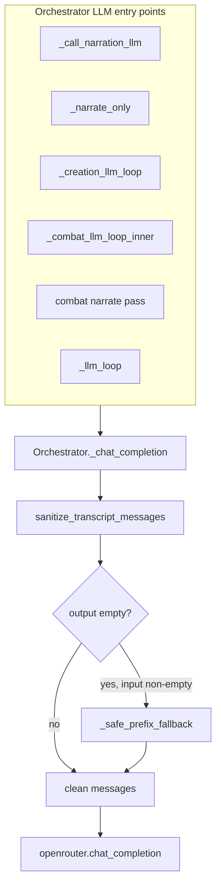

# Implementation Plan: APP-031-transcript-sanitize-orphan-tool-messages

**Status:** draft  
**backlog_ticket:** APP-031  
**ticket_path:** [tmp/backlog/app-031-transcript-sanitize-orphan-tool-messages.md](../../app-031-transcript-sanitize-orphan-tool-messages.md)  
**domain_spec:** [tmp/app-llm-orchestrator-spec.md](../../../app-llm-orchestrator-spec.md)  
**Spec:** [spec.md](./spec.md) · [research-brief.md](./research-brief.md) · [qa-spec-pass.md](./qa-spec-pass.md)  
**Stage:** Dev plan (pre-implementation)

## Summary

Add a **non-mutating** module-level `sanitize_transcript_messages()` in `app/gm/orchestrator.py` and route all six in-orchestrator `chat_completion` calls through a single `_chat_completion()` wrapper that sanitizes immediately before delegating to `gm.openrouter.chat_completion`. The sanitizer enforces OpenAI chat tool-message invariants (strip invalid `tool_calls`, drop orphan `tool` rows, **APP-028 reorder** of system-before-tool failure lines) and applies the **safe-prefix fallback** when the walk would otherwise yield an empty array.

**Primary regression:** Google 400 — *Tool-call assistant message produced no valid function calls but is followed by tool result messages* — on depth ≥1 resubmit after malformed multi-tool rounds (Holt / `remember_fact` session 2026-05-20).

**Pairing:** APP-031 prevent → APP-032 recover (shared helper import; no 400 retry in this ticket).

---

## Files (implementation scope ⊆ ticket Expected files)

| File | Action |
|------|--------|
| `app/gm/orchestrator.py` | Add `sanitize_transcript_messages`, `_safe_prefix_fallback`, optional `_is_valid_tool_call`; add `Orchestrator._chat_completion`; replace 6 direct `chat_completion` calls |
| `app/tests/test_transcript_sanitize.py` | **New** — unit matrix + `_llm_loop` integration mock |
| `tmp/app-llm-orchestrator-spec.md` | On close: mark checklist done, changelog (not in impl phase) |

**Out of scope:** `app/gm/openrouter.py` (pass-through unchanged); APP-032 retry; APP-034 `transcript_sanitized` JSONL (R5 optional/deferred).

---

## Architecture



### Wire pattern

```python
def sanitize_transcript_messages(messages: list[dict[str, Any]]) -> list[dict[str, Any]]:
    ...

def _safe_prefix_fallback(messages: list[dict[str, Any]]) -> list[dict[str, Any]]:
    ...

class Orchestrator:
    def _chat_completion(
        self,
        *,
        messages: list[dict[str, Any]],
        tools: list | None = None,
        tool_choice: str | dict | None = "auto",
        max_tokens: int | None = None,
        temperature: float | None = None,
    ) -> dict:
        clean = sanitize_transcript_messages(messages)
        return chat_completion(
            self.client,
            model=self.model,
            messages=clean,
            tools=tools,
            tool_choice=tool_choice if tools else "auto",
            max_tokens=max_tokens if max_tokens is not None else self.max_tokens,
            temperature=temperature if temperature is not None else self.temperature,
        )
```

- **Module-level export** of `sanitize_transcript_messages` (and optionally `_safe_prefix_fallback` if APP-032 needs it separately) — no import from `openrouter`.
- Existing tests monkeypatch `gm.orchestrator.chat_completion` — keep working unchanged (wrapper still calls that symbol).
- R5 observability: skip in v1 unless trivial; do not block close.

---

## `sanitize_transcript_messages()` design

### Contract (R1)

| Property | Rule |
|----------|------|
| Mutability | Return **new** `list`; each output message is `{**msg}` shallow copy (mutate copies inside helper only) |
| Raises | Never — malformed roles/keys treated as pass-through or dropped per rules below |
| Empty input | `[]` |
| Empty walk, non-empty input | `_safe_prefix_fallback(input)` |

### `_is_valid_tool_call(tc: Any) -> bool`

Structural check only (not APP-080 arg semantics):

| Field | Valid when |
|-------|------------|
| `id` | non-empty `str` after strip |
| `function` | `dict` with non-empty `str` `name` after strip |
| `function.arguments` | key **present**; value is `str` (may be `"{}"`) |

Invalid entries are **removed** from the assistant’s `tool_calls` list (copy), not repaired.

### Pass 1 — per-message normalization (left-to-right scan of input)

For each `msg` (shallow-copied):

| `role` | Action |
|--------|--------|
| `assistant` | If `tool_calls` present: filter to valid calls only. If none remain: emit content-only assistant (`content` preserved; **omit** `tool_calls` key). If `content` is `None`/missing and no valid calls: **drop** message entirely (empty shell). |
| `tool` | Defer to pass 2 (collect raw copies) |
| other | Append copy unchanged |

### Pass 2 — tool rounds, orphan drop, APP-028 reorder

Maintain `output: list[dict]`. Walk normalized stream index `i`:

1. Append non-assistant/non-tool messages directly to `output`.
2. On **assistant with valid `tool_calls`** (non-empty after pass 1):
   - Let `expected_ids = {tc["id"] for tc in tool_calls}`.
   - **Look ahead** from the next input index until end **or** next `assistant` with non-empty valid `tool_calls` (start of next round). Collect segment `seg`.
   - From `seg`, partition:
     - `tools`: `role == "tool"` and `tool_call_id in expected_ids` (preserve relative order among matched tools)
     - `deferred`: all other messages in `seg` (typically APP-028 `system` TOOL FAILED lines; may include `user` directives)
     - Unmatched `tool` in `seg`: **drop** (count for optional R5)
   - Emit: `assistant_copy` → **all** `tools` → **all** `deferred` (content preserved; order among deferred unchanged)
   - Advance `i` past consumed `seg`
3. On **`tool` not consumed in step 2** (no preceding assistant round): **drop** (orphan)
4. On **assistant content-only**: append copy

**APP-028 invariant after step 2:** For every assistant with `tool_calls`, the next N messages are exactly the N matched `tool` rows (N ≤ len(tool_calls)); any `system`/`user` that was between assistant and tools in the orchestrator append order now follows the tool block.

**Round-trip:** Valid chain `assistant + tool(A) + tool(B)` with no interstitial → unchanged order and ids.

**Empty assistant after failed round:** `assistant {content: null, tool_calls: [invalid]}` + orphan `tool` → pass 1 drops assistant → orphan dropped → walk may empty → safe-prefix (see tests).

### `_safe_prefix_fallback(messages) -> list[dict]`

When pass 2 would return `[]` but `messages` was non-empty:

1. Copy all **leading** `role == "system"` messages from **original input**, in order (stop at first non-system).
2. If any `role == "user"` exists anywhere in input, append shallow copy of the **last** `user` only.
3. Else return `[]`.

**Explicit non-goal (PM r2 / QA adversarial note):** Do **not** append trailing content-only `assistant` — APP-032 truncate path may extend later.

### Optional test helper (in test module, not orchestrator)

```python
def assert_transcript_invariants(messages: list[dict]) -> None:
    """Every tool row has matching id on nearest preceding assistant tool_calls."""
```

Used by unit tests and integration mock assertions.

---

## Deep code-path traces — six `chat_completion` sites

All paths today call `chat_completion(self.client, ...)` with **no** pre-sanitize. After APP-031, each path calls `self._chat_completion(...)` instead; traces below describe **message shape at send time**.

### Site 1 — `_call_narration_llm` (~L1042–1061)

**Call chain**

```
process_turn → _creation_turn → _auto_present_* / narrate_with_verification
  → _narrate_flavor → _call_narration_llm(messages)
    → chat_completion  # SITE 1
```

**Messages built:** `_creation_flavor_messages()` (~L1022–1040): `[system SYSTEM_PROMPT, system creation brief + TurnTruth, *history[-4:] (user|assistant str only), user player_input]`.

| Property | Value |
|----------|-------|
| Tool roles in array? | **No** — history has no tool rows |
| Malformed tool risk | **Low** — sanitize is no-op on valid arrays |
| Why wire? | R4 requires all six sites; single wrapper avoids drift |

**Exception path:** `log_error("narrate_flavor")` → static fallback; sanitize does not run on failure after call.

---

### Site 2 — `_narrate_only` (~L1669–1686)

**Call chain**

```
_combat_turn → _narrate_text(prompt)  # L1902–1907, L1967, L1984, L2017
  → _narrate_only([system SYSTEM_PROMPT, user prompt])
    → chat_completion  # SITE 2
```

**Messages:** Fixed 2-row narrate-only arrays (combat aftermath, monster phase, initiative epilogue).

| Property | Value |
|----------|-------|
| Tool roles? | **No** |
| Risk | **Low** |
| Depth | Single shot — no in-turn tool accumulation |

---

### Site 3 — `_creation_llm_loop` (~L1688–1790, call ~L1700)

**Call chain**

```
# Zero callers under app/ today (code-first _creation_turn_body — APP-057/079 research)
# Retained dead path; still must wire per domain spec + R4
_creation_llm_loop(messages, tools, tool_choice)
  for depth in range(4):
    chat_completion(..., tools=depth<2 else None)  # SITE 3
    → append assistant + tool_calls
    → for tc: append tool only (no APP-028 system on failure)
    → recurse same messages list
```

**Failure mode (if revived):** Invalid `tool_calls` + appended `tool` → depth+1 SITE 3 400 — same invariant as exploration.

| Property | Value |
|----------|-------|
| APP-028 system injection | **No** — only orphan/invalid-call stripping applies |
| Test priority | Unit tests only; no integration unless path re-wired |

---

### Site 4 — `_combat_llm_loop_inner` tool pass (~L2041–2055)

**Call chain**

```
process_turn → _combat_turn → _combat_llm_loop(player_input, status)  # L2002/L2014
  → build_messages(SYSTEM, state_context, history, player_input)  # no tool roles in history
  → _combat_llm_loop_inner(messages, depth=0)
    → chat_completion(..., tools=[COMBAT_ACTION_TOOL])  # SITE 4
```

**In-turn append (~L2068–2098):**

```
messages += assistant(content, tool_calls)
for tc in tool_calls:
  if not result.ok:
    messages += system "TOOL FAILED (fn_name): ..."   # APP-028 ordering risk
  messages += tool(tool_call_id=tc.id, content=json result)
```

**Recursion:** `return self._combat_llm_loop_inner(messages, depth+1)` — not explicit in snippet; loop continues via re-entry at end? Actually reading code - there's no explicit recurse at end for success path - it goes to narrate pass. On tool_calls, it doesn't recurse - it falls through to narrate. Wait, let me re-read combat loop...

Looking at the code again:
- If tool_calls: append assistant, run tools, if all_failed return prefix early
- Otherwise continue to narrate pass (SITE 5)
- There's NO depth recursion like _llm_loop!

Actually `_combat_llm_loop_inner` only checks `if depth > 3` at start but I don't see `return self._combat_llm_loop_inner(messages, depth+1)` in the excerpt. Let me check...

From my read:
- depth parameter exists but recursion might not happen in combat inner loop
- depth is always 0 from `_combat_llm_loop`

So combat is **single** tool round then narrate — but SITE 4 still accumulates assistant+system+tool in `messages` passed to SITE 5. **APP-028 reorder matters between SITE 4 append and SITE 5 send.**

---

### Site 5 — Combat narrate pass (~L2127–2142)

**Call chain**

```
_combat_llm_loop_inner (after successful tools, not all_failed)
  → narrate_messages = messages + [user brief + "Narrate... Do not call more tools."]
  → chat_completion(..., tools=None)  # SITE 5
```

**Messages:** Full tool chain from SITE 4 (assistant, system TOOL FAILED lines, tool rows) + synthetic user brief.

| Property | Value |
|----------|-------|
| Primary APP-028 surface | **Yes** — strict providers 400 on SITE 5 if system sits between assistant and tools |
| Sanitize effect | Reorder tool block before deferred system lines; drop orphan tools if any call invalid |

**Exception:** `except Exception: return brief` — no APP-032 retry.

---

### Site 6 — `_llm_loop` (~L2187–2320, call ~L2212)

**Call chain**

```
process_turn (exploration) → build_messages(...) → _llm_loop(messages, depth=0)  # L929–937
  → chat_completion(..., tools=TOOLS if allow_tools and depth<3)  # SITE 6
  → append assistant + tool_calls
  → for tc: [optional system TOOL FAILED] + tool   # L2276–2287 APP-028
  → early exits: beat_failure, all_failed+content, all_failed+depth>=2 user directive
  → return _llm_loop(messages, depth+1)  # L2320 — resubmit full array at SITE 6
```

**Primary failure surface (research):**

| Depth | Array state before SITE 6 |
|-------|-------------------------|
| 0 | `[system*, user]` — clean |
| 1 | Prior assistant/tool round + possible system lines — **orphan risk** if model returned invalid `tool_calls` at depth 0 but orchestrator appended tools |
| 2–4 | Accumulated multi-tool chain |

**Holt shape (depth 1 resubmit):**

```
[..., assistant{tool_calls:[invalid or stripped]}, system TOOL FAILED, tool{remember_fact}, ...]
→ sanitize → assistant valid calls only + tools adjacent + system after tools
→ or strip to safe-prefix if entire round collapses
```

**400 today:** L2220–2224 `log_error("chat_completion")` → fallback prose — APP-032 scope.

---

## APP-028 reorder — implementation detail

**Problem (orchestrator today):** Per failed tool, exploration/combat loops append:

```text
assistant(tool_calls: [tc1, tc2])
  system TOOL FAILED (tc1)
  tool tc1
  system TOOL FAILED (tc2)
  tool tc2
```

Strict providers expect:

```text
assistant(tool_calls: [tc1, tc2])
  tool tc1
  tool tc2
  system TOOL FAILED (tc1)
  system TOOL FAILED (tc2)
```

**Sanitizer responsibility:** Reorder only — **do not drop** TOOL FAILED text (R3).

**Do not change append order in loops in APP-031** — reorder at send boundary keeps APP-028 behavior localized and avoids duplicating reorder at six sites.

**Partial failure (one ok, one fail):** Same reorder applies; matched tools only; unmatched ids dropped.

---

## Task breakdown

1. **Helpers** — Add `_is_valid_tool_call`, `_safe_prefix_fallback`, `sanitize_transcript_messages` near top of `orchestrator.py` (after imports; before `Orchestrator` or after module constants — match existing module-level helpers like `sanitize_premature_site_entry_flavor` pattern if any are module-level).
2. **Wrapper** — Add `Orchestrator._chat_completion`; mirror kwargs used at each site (`max_tokens` override for `_call_narration_llm`).
3. **Replace call sites** — Six substitutions; preserve surrounding try/except and logging.
4. **Tests** — New `test_transcript_sanitize.py` per matrix below.
5. **Regression** — `cd app && python -m pytest tests/ -q`.
6. **Close** — Domain spec changelog + ticket release (separate stage).

---

## Test matrix — `app/tests/test_transcript_sanitize.py`

**Run:**

```bash
cd app && python -m pytest tests/test_transcript_sanitize.py -q
cd app && python -m pytest tests/ -q
```

| Test ID | Name (spec) | Setup | Assert |
|---------|-------------|-------|--------|
| T1 | `test_orphan_tool_no_preceding_assistant` | `[user, {role:tool, tool_call_id:x}]` | Output `[user]`; `assert_transcript_invariants` |
| T2 | `test_assistant_empty_tool_calls_followed_by_tool` | `[assistant tool_calls:[], tool]` | Content-only assistant or dropped if empty; tool removed |
| T3 | `test_invalid_tool_call_missing_id` | assistant invalid `id` + matching tool | Invalid call stripped; tool dropped |
| T4 | `test_valid_two_tool_chain` | assistant 2 calls + 2 tools matched | `==` input structure (copies not same objects) |
| T5 | `test_unmatched_tool_call_id` | assistant id A + tool A + tool B (wrong id) | Tool B dropped; A kept |
| T6 | `test_system_between_assistant_and_tool` | assistant → system TOOL FAILED → tool | Tool immediately after assistant; system after tool |
| T7 | `test_holt_session_shape` | Fixture: structurally invalid calls (empty `tool_calls` or missing `function.name`) + tool row(s) post-dispatch | Invariants pass; no orphan tools; optional: no assistant with empty `tool_calls` key adjacent to tools |
| T8 | `test_wrapper_called_in_llm_loop` | Monkeypatch `chat_completion`; queue depth-0 tools + depth-1 text; inject malformed assistant at depth 0 | Second call `kwargs["messages"]` passes `assert_transcript_invariants` |
| T9 | `test_sanitize_does_not_mutate_caller_list` | Pre-built list + dict refs | Input list length, dict values unchanged after sanitize |
| T10 | `test_tail_invalid_returns_safe_prefix` | See table below | Exact expected prefix |

**T10 cases (pinned):**

| Input | Expected output |
|-------|-----------------|
| `[{role:tool, ...}]` only | `[]` |
| `[system, user, {role:tool}]` | `[system, user]` (shallow copies) |
| `[system, system, user, assistant{invalid calls}+tool]` | `[system, system, user]` |

**Fixtures:** Local helpers `_tool_call()`, `_tool_result()`, `_assistant_tool_round()` — mirror `test_exploration_site_entry_gate.py` / `test_combat_failure_narration.py`.

**Integration (T8) sketch:**

```python
responses = [
    {"tool_calls": [_tool_call("remember_fact", {...}, call_id="c1")], "content": ""},
    {"content": "Narration.", "tool_calls": []},
]
# Monkeypatch _execute_tool to return {ok: False} first call
# Capture messages on chat_completion call #2
```

**Holt fixture (T7):** Model **API-normalized** failure — assistant message with `tool_calls: []` or calls missing `function.name`, while orchestrator still appended `tool` from parsed response object. Encode explicitly; do not read gitignored session JSONL.

---

## Rollback / flags

- No feature flag — sanitize always on (R4).
- Rollback: revert wrapper + helper; restore direct `chat_completion` calls.
- Risk: over-stripping loses model context — mitigated by dropping orphan tools only, preserving valid chains and TOOL FAILED text (reordered).

---

## Open questions

| # | Question | Dev decision |
|---|----------|--------------|
| 1 | Place helpers above or below `Orchestrator` class? | **Above class** next to other module-level functions — easier import for APP-032 |
| 2 | Export `_safe_prefix_fallback`? | **Yes** (module private name) — APP-032 may truncate then sanitize |
| 3 | Log `transcript_sanitized` in v1? | **Defer** (R5 / APP-034) unless impl is trivial |
| 4 | `_creation_llm_loop` integration test? | **Skip** — zero callers; unit coverage sufficient |
| 5 | Combat depth recursion | **No change** — combat uses single tool pass + narrate; APP-028 reorder still critical at SITE 5 |

---

## Domain spec on close

- Mark § Transcript sanitize checklist done.
- Changelog entry: helper + wrapper + tests.
- Confirm APP-032 pairing paragraph unchanged.
