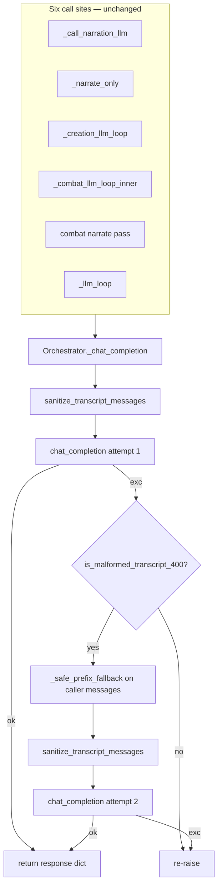

# Implementation Plan: APP-032-400-retry-malformed-transcript

**Status:** draft  
**backlog_ticket:** APP-032  
**ticket_path:** [tmp/backlog/app-032-400-retry-on-malformed-transcript.md](../../app-032-400-retry-on-malformed-transcript.md)  
**domain_spec:** [tmp/app-llm-orchestrator-spec.md](../../../app-llm-orchestrator-spec.md)  
**Spec:** [spec.md](./spec.md) · [research-brief.md](./research-brief.md) · [qa-spec-pass.md](./qa-spec-pass.md)  
**Stage:** Dev plan (pre-implementation)

## Summary

Extend the existing APP-031 `_chat_completion` wrapper with a **reactive safety net**: when the provider rejects an in-turn transcript with a **narrow** malformed-transcript **400**, truncate to `_safe_prefix_fallback(messages)`, re-run `sanitize_transcript_messages`, and retry **once**. All six call sites inherit retry without changes.

**Pairing:** APP-031 prevent (proactive sanitize) → APP-032 recover (truncate + retry). Shared primitives only — no duplicate invariant logic.

**Primary regression:** Exploration `_llm_loop` depth ≥1 resubmit no longer returns `"The GM falters. (API error: …)"` when the first HTTP attempt 400s on Google’s tool-order string but a safe-prefix retry would succeed.

---

## Files (implementation scope ⊆ ticket Expected files)

| File | Action |
|------|--------|
| `app/gm/orchestrator.py` | Add `is_malformed_transcript_400`; wrap `_chat_completion` with try/except retry loop |
| `app/tests/test_transcript_400_retry.py` | **New** — detection parametrize + retry matrix + `_llm_loop` integration |
| `tmp/app-llm-orchestrator-spec.md` | On close: mark checklist done, changelog (not in impl phase) |

**Out of scope:** `openrouter.py`; caller loop edits; in-place repair of caller `messages`; non-400 retries; `transcript_400_retry` JSONL (R5 optional → APP-034).

---

## Architecture



### Wire pattern (target `_chat_completion`)

```python
from openai import APIStatusError, BadRequestError

_MALFORMED_TRANSCRIPT_MARKERS = (
    "tool-call assistant message produced no valid function calls",
    "no valid function calls but is followed by tool",
)


def is_malformed_transcript_400(exc: BaseException) -> bool:
    """Narrow 400 classifier for transcript tool-order rejections (APP-032)."""
    try:
        if not isinstance(exc, (BadRequestError, APIStatusError)):
            return False
        if getattr(exc, "status_code", None) != 400:
            return False
        msg = str(exc).casefold()
        if any(m in msg for m in _MALFORMED_TRANSCRIPT_MARKERS):
            return True
        if "tool result messages" in msg and (
            "tool_call" in msg or "tool_calls" in msg
        ):
            return True
        return False
    except Exception:
        return False


class Orchestrator:
    def _chat_completion(self, *, messages, tools=None, tool_choice="auto",
                         max_tokens=None, temperature=None) -> dict:
        clean = sanitize_transcript_messages(messages)
        cc_kwargs = dict(
            client=self.client,
            model=self.model,
            tools=tools,
            tool_choice=tool_choice,
            max_tokens=max_tokens if max_tokens is not None else self.max_tokens,
            temperature=temperature if temperature is not None else self.temperature,
        )
        try:
            return chat_completion(messages=clean, **cc_kwargs)
        except Exception as exc:
            if not is_malformed_transcript_400(exc):
                raise
            truncated = _safe_prefix_fallback(messages)  # caller original, not clean
            retry_clean = sanitize_transcript_messages(truncated)
            return chat_completion(messages=retry_clean, **cc_kwargs)
```

**Design notes**

- **Single retry budget:** no loop — second `chat_completion` is bare; any exception propagates to existing caller `except Exception` paths.
- **Truncate source:** `_safe_prefix_fallback(messages)` uses the **caller’s original** array (may still contain malformed assistant/tool tail). Spec R2 — not the already-sanitized `clean` from attempt 1.
- **Kwargs parity:** build `cc_kwargs` once; both attempts share `tools`, `tool_choice`, `max_tokens`, `temperature`.
- **Non-mutating:** truncate/sanitize produce new lists; caller `messages` ref and dict contents unchanged (same APP-031 contract).
- **Import placement:** add `from openai import APIStatusError, BadRequestError` near top of `orchestrator.py` (alongside existing imports). Export `is_malformed_transcript_400` at module level for tests (spec R1).

---

## `is_malformed_transcript_400(exc)` design (R1)

| Property | Rule |
|----------|------|
| Raises | **Never** — outer `try/except` returns `False` on any internal failure |
| Type gate | `isinstance(exc, BadRequestError)` **or** `isinstance(exc, APIStatusError)` with `exc.status_code == 400` |
| Positive match | `str(exc).casefold()` contains **≥1** of: |
| | • `tool-call assistant message produced no valid function calls` |
| | • `no valid function calls but is followed by tool` |
| | • `tool result messages` **and** (`tool_call` **or** `tool_calls` in same string) |
| Negative | `"invalid model"`, `"invalid_api_key"`, `"context_length"`, 429/5xx types → `False` |
| Third-marker edge | QA adversarial note: `"tool result messages"` alone without `tool_call(s)` → `False` |

**Why narrow:** unrelated 400s (bad model, auth, context) must not silently drop in-turn tool context via truncate.

**Test construction:** use `httpx.Response(400, request=httpx.Request("POST", "http://test"))` + `BadRequestError(message, body={}, response=response)` — verified locally on OpenAI SDK 2.x (`status_code` available).

---

## `_chat_completion` retry loop (R2)

### Per-invocation flow

| Step | Action |
|------|--------|
| 1 | `clean = sanitize_transcript_messages(messages)` — existing APP-031 |
| 2 | First `chat_completion(..., messages=clean)` |
| 3 | On success → return dict (callers unchanged) |
| 4 | On exception → if **not** `is_malformed_transcript_400(exc)` → **re-raise** |
| 5 | `truncated = _safe_prefix_fallback(messages)` |
| 6 | `retry_clean = sanitize_transcript_messages(truncated)` |
| 7 | Second `chat_completion(..., messages=retry_clean)` — **exactly one** retry |
| 8 | Second failure → **re-raise** (any exception type) |

### Retry budget scope

- **Once per `_chat_completion` call** — not once per turn.
- Multi-depth `_llm_loop` / `_creation_llm_loop` may each trigger an independent retry at their depth (domain spec + research confirmed; do not add turn-level cap).

### Recovery quality

`_safe_prefix_fallback` drops the entire in-turn tool chain (leading `system` + last `user` only). Acceptable v1 vs hard fail; do **not** widen to trailing content-only `assistant` without PM ticket.

### Caller `messages` not repaired (known v1 limit)

Retry sends truncated copy to API only; loops keep appending to the original mutable list. A successful retry at depth N does not strip malformed tail — depth N+1 may 400 again (another per-call retry). **Out of scope** per spec non-goals and QA adversarial note #1.

---

## Code-path traces — intercept and inheritance

### Change: malformed-transcript 400 intercept

| Step | File:symbol | Action |
|------|-------------|--------|
| 1 | `orchestrator.py:is_malformed_transcript_400` | **Add** module helper + marker tuple |
| 2 | `orchestrator.py:Orchestrator._chat_completion` | **Wrap** existing sanitize + delegate in try/except retry |
| 3 | `orchestrator.py` imports | **Add** `BadRequestError`, `APIStatusError` from `openai` |
| 4 | Six call sites | **No edits** — inherit via wrapper |

### Site inheritance (all paths today → `_chat_completion` → sanitize only)

| Site | Symbol | On exhausted retry (unchanged) |
|------|--------|--------------------------------|
| 1 | `_call_narration_llm` | `_NAME_LENGTH_STATIC_FALLBACK` + `log_error("narrate_flavor")` |
| 2 | `_narrate_only` | `"The clerk regards you with a weary sigh."` |
| 3 | `_creation_llm_loop` | `"The clerk mutters something unintelligible."` |
| 4 | `_combat_llm_loop_inner` tools | `"[Mechanics failed — API error: …]"` |
| 5 | Combat narrate pass | mechanical `brief` string |
| 6 | `_llm_loop` | `_last_content` or `"The GM falters. (API error: …)"` |

### Primary player-visible path — `_llm_loop` depth ≥1

```
process_turn → build_messages → _llm_loop(messages, depth=0)
  → _chat_completion (depth 0) — tools
  → append assistant + tool_calls + [system TOOL FAILED] + tool
  → _llm_loop(messages, depth+1)
  → _chat_completion (depth 1) — APP-031 sanitize; may still 400 on strict provider
  → APP-032: truncate to safe prefix → retry once
  → success → normal tool/text handling (no GM falters)
  → exhausted → existing except at L2343–2347
```

**TurnTruth gate:** N/A — API transcript layer only; no narration verify changes.

---

## Task breakdown

1. **Detection helper** — Add `is_malformed_transcript_400` + `_MALFORMED_TRANSCRIPT_MARKERS` immediately after `_safe_prefix_fallback` / `sanitize_transcript_messages` block (~L309) for APP-031 adjacency.
2. **Retry wrapper** — Refactor `_chat_completion` (~L1174) to shared `cc_kwargs` + try/except retry per R2; preserve existing kwarg defaults (`tool_choice`, `max_tokens`, `temperature`).
3. **Tests** — New `test_transcript_400_retry.py` per matrix below; import `assert_transcript_invariants` from `test_transcript_sanitize.py` (or duplicate minimal helper if import cycles — prefer import).
4. **Regression** — `pytest tests/test_transcript_sanitize.py tests/test_transcript_400_retry.py tests/ -q`.
5. **Close** — Domain spec checklist + ticket `release APP-032 --done` (separate stage).

---

## Test matrix — `app/tests/test_transcript_400_retry.py`

**Run:**

```bash
cd app && python -m pytest tests/test_transcript_400_retry.py -q
cd app && python -m pytest tests/test_transcript_sanitize.py -q
cd app && python -m pytest tests/ -q
```

### Shared test helpers (new module)

```python
import httpx
from openai import BadRequestError, APIStatusError, APIConnectionError, RateLimitError

GOOGLE_MALFORMED_MSG = (
    "Tool-call assistant message produced no valid function calls "
    "but is followed by tool result messages"
)

def _bad_request_400(message: str) -> BadRequestError:
    response = httpx.Response(400, request=httpx.Request("POST", "http://test"))
    return BadRequestError(message, body={}, response=response)
```

Reuse `_tool_call`, `_assistant_tool_round`, `exploration_ready` fixture patterns from `test_transcript_sanitize.py` where integration needs them.

| Test ID | Name | Setup | Assert |
|---------|------|-------|--------|
| R1a | `test_is_malformed_transcript_400_cases` | `@pytest.mark.parametrize` positive: Google string; substring variants; third marker with `tool_calls` in text | `is_malformed_transcript_400(exc) is True` |
| R1b | (same test, negative rows) | `"invalid model"`, `"invalid_api_key"`, `"context_length"` 400; `RateLimitError`; `APIConnectionError`; 400 with `"tool result messages"` only (no tool_call tokens) | `False` |
| R2 | `test_malformed_400_then_success` | `Orchestrator` instance (minimal config mock client); monkeypatch `chat_completion`: raise `_bad_request_400(GOOGLE_MALFORMED_MSG)` on call 1, ok dict on call 2; input `messages` = Holt-shaped depth-1 array (system + user + assistant/tools) | Returns response; `call_count == 2`; 2nd call `messages` == `sanitize_transcript_messages(_safe_prefix_fallback(original))`; passes `assert_transcript_invariants`; shape is leading `system`(s) + last `user` only |
| R3 | `test_unrelated_400_no_retry` | Mock raises `_bad_request_400("invalid model: foo")` | `pytest.raises(BadRequestError)`; `call_count == 1` |
| R4 | `test_malformed_400_twice_propagates` | Mock raises malformed 400 both times | `pytest.raises(BadRequestError)`; `call_count == 2`; 2nd attempt uses safe-prefix sanitized messages |
| R5 | `test_non_400_no_retry` | Mock raises `RateLimitError` or `APIConnectionError` on first call | Single attempt; no retry |
| R6 | `test_caller_messages_unchanged_after_retry` | Shared `messages` list ref with nested dicts; fail-then-ok mock | After `_chat_completion`, input list length, dict identity, and field values unchanged vs snapshot before call |
| R7 | `test_llm_loop_depth1_retry_integration` | Extend `test_wrapper_called_in_llm_loop` pattern: `exploration_ready` + monkeypatch `chat_completion` — call 1 returns tool_calls; call 2 raises malformed 400; call 3 ok with narration | `result == "Narration."`; result does **not** contain `"The GM falters"`; total `chat_completion` invocations == 3 (depth-0 tool, depth-1 fail, depth-1 retry success) |

### R2 message fixture (pinned)

Input before retry (malformed tail survives in caller list):

```python
messages = [
    {"role": "system", "content": "sys"},
    {"role": "user", "content": "remember and travel"},
    {"role": "assistant", "content": None, "tool_calls": []},  # provider-invalid
    {"role": "system", "content": "TOOL FAILED (remember_fact): boom"},
    {"role": "tool", "tool_call_id": "c1", "content": "{}"},
]
```

Expected 2nd-attempt API payload:

```python
[
    {"role": "system", "content": "sys"},
    {"role": "user", "content": "remember and travel"},
]
```

(shallow copies — not same object refs as input)

### R7 integration sketch

```python
call_index = 0

def fake_chat(*args, **kwargs):
    nonlocal call_index
    call_index += 1
    if call_index == 1:
        return {"content": "", "tool_calls": _tool_call(...), "finish_reason": "tool_calls"}
    if call_index == 2:
        raise _bad_request_400(GOOGLE_MALFORMED_MSG)
    return {"content": "Narration.", "tool_calls": [], "finish_reason": "stop"}

monkeypatch.setattr("gm.orchestrator.chat_completion", fake_chat)
# _execute_tool → {ok: False} to build APP-028 system+tool tail
result = exploration_ready._llm_loop([system, user])
```

---

## Acceptance criteria mapping

| Ticket / spec AC | Plan coverage |
|------------------|---------------|
| Malformed transcript 400 → truncate + retry once | `_chat_completion` retry loop + R2/R4 tests |
| `is_malformed_transcript_400` narrow detection | Helper design + R1 parametrize |
| Reuse APP-031 primitives | `_safe_prefix_fallback` + `sanitize_transcript_messages`; no fork |
| Non-mutating caller list | R6 test + design note |
| Six sites unchanged | No caller edits; inheritance table |
| Unrelated 400 / non-400 no retry | R3, R5 tests |
| `_llm_loop` no GM falters on recoverable 400 | R7 integration |
| R5 observability optional | Defer `transcript_400_retry` JSONL to APP-034 |

---

## Rollback / flags

- No feature flag — retry always active when detection matches (same as APP-031 always-sanitize).
- Rollback: revert helper + try/except wrapper; restore sanitize-only `_chat_completion`.
- Risk: false-positive detection truncates context — mitigated by narrow substring list + negative fixtures.

---

## Open questions

| # | Question | Dev decision |
|---|----------|--------------|
| 1 | Import `assert_transcript_invariants` from sibling test module? | **Yes** — `from tests.test_transcript_sanitize import ...` or relative import per conftest path; duplicate only if import fails |
| 2 | Log `transcript_400_retry` in v1? | **Defer** (R5 / APP-034) — not blocking close |
| 3 | Mutate caller `messages` after successful retry? | **No** — spec non-goal; document in reflection |
| 4 | `APIStatusError` non-`BadRequestError` 400? | **Support** via shared `status_code == 400` branch in helper |
| 5 | Place helper above or below `Orchestrator`? | **Below sanitize helpers, above class** — matches APP-031 plan |

---

## Domain spec on close

- Mark § Reactive 400 retry checklist item done.
- Changelog entry: `is_malformed_transcript_400` + `_chat_completion` retry + `test_transcript_400_retry.py`.
- Confirm APP-031 pairing paragraph unchanged.
