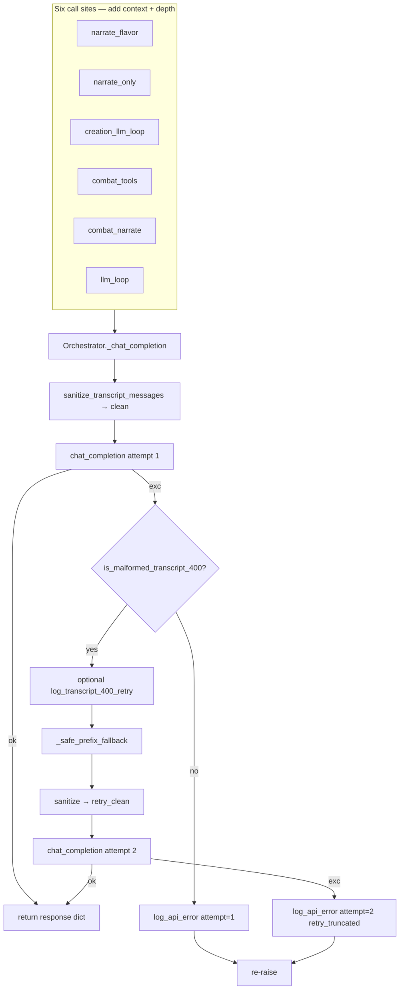

# Implementation Plan: APP-034-log-tool-chain-on-api-errors

**Status:** draft  
**backlog_ticket:** APP-034  
**ticket_path:** [tmp/backlog/app-034-log-tool-chain-on-api-errors.md](../../app-034-log-tool-chain-on-api-errors.md)  
**domain_spec:** [tmp/app-llm-orchestrator-spec.md](../../../app-llm-orchestrator-spec.md)  
**Spec:** [spec.md](./spec.md) · [research-brief.md](./research-brief.md) · [qa-spec-pass.md](./qa-spec-pass.md)  
**Stage:** Dev plan (pre-implementation)

## Summary

Extend the existing APP-032 `_chat_completion` wrapper to emit **one structured JSONL `api_error` event** on every API failure (non-retryable re-raise or second-attempt exhaustion), with a **redacted in-turn tool-chain snapshot** (`messages_summary`, `tool_chain`). Implement redaction and serialization helpers in `logger.py`. Pass `context` / `depth` from six call sites; **remove duplicate caller `log_error`** for the same exception. Combat silent paths inherit logging via the wrapper without caller changes.

**Pairing:** APP-031 prevent (sanitize) → APP-032 recover (400 retry) → **APP-034 observe** (residual failures + retry outcomes). Optional R6: `transcript_400_retry` info when malformed 400 retry runs — non-blocking for close.

**Primary regression:** Mock API failure during exploration tool turn → JSONL contains `api_error` with non-empty `tool_chain`; combat tool pass failure → `context: combat_tools` (fixes L2234–2235 silent gap).

---

## Files (implementation scope ⊆ ticket Expected files)

| File | Action |
|------|--------|
| `app/gm/logger.py` | Add `REDACTED`, `redact_secrets`, `summarize_messages_for_log`, `extract_tool_chain`, `log_api_error`, optional `log_transcript_400_retry` |
| `app/gm/orchestrator.py` | Extend `_chat_completion` intercept; pass `context`/`depth` at six sites; remove duplicate `log_error` on API failure paths |
| `app/tests/test_api_error_logging.py` | **New** — R1–R5 unit + integration matrix |
| `tmp/app-llm-orchestrator-spec.md` | On close: checklist + changelog (not in impl phase) |
| `tmp/app-logging-qa-spec.md` | On close: JSONL table rows for `api_error`, optional `transcript_400_retry` (cross-sync noted in spec header) |

**Out of scope:** `openrouter.py`; APP-031/032 sanitize/retry logic changes; success-path tool logging; PII scrub beyond API-key patterns; `tool_arg_coerced` / proactive `transcript_sanitized`.

---

## Architecture



### Wire pattern (target `_chat_completion`)

```python
def _emit_api_error(
    *,
    exc: BaseException,
    attempt: int,
    sent_messages: list[dict],
    original_messages: list[dict],
    context: str | None,
    depth: int | None,
    tools: list | None,
    retry_truncated: bool = False,
) -> None:
    log_api_error({
        "context": context or "unknown",
        "exc_type": type(exc).__name__,
        "error": str(exc),  # redacted inside log_api_error
        "model": self.model,
        "tools_present": tools is not None,
        "attempt": attempt,
        "malformed_transcript_400": is_malformed_transcript_400(exc),
        "original_len": len(original_messages),
        "sent_len": len(sent_messages),
        "messages_summary": summarize_messages_for_log(sent_messages),
        "tool_chain": extract_tool_chain(sent_messages),
        **({"depth": depth} if depth is not None else {}),
        **({"retry_truncated": True} if retry_truncated else {}),
    })


def _chat_completion(
    self,
    *,
    messages: list[dict[str, Any]],
    tools: list | None = None,
    tool_choice: str | dict | None = "auto",
    max_tokens: int | None = None,
    temperature: float | None = None,
    context: str | None = None,
    depth: int | None = None,
) -> dict:
    clean = sanitize_transcript_messages(messages)
    cc_kwargs = dict(
        model=self.model,
        messages=clean,
        tools=tools,
        tool_choice=tool_choice,
        max_tokens=max_tokens if max_tokens is not None else self.max_tokens,
        temperature=temperature if temperature is not None else self.temperature,
    )
    try:
        return chat_completion(self.client, **cc_kwargs)
    except Exception as exc:
        if not is_malformed_transcript_400(exc):
            _emit_api_error(
                exc=exc, attempt=1, sent_messages=clean,
                original_messages=messages, context=context, depth=depth, tools=tools,
            )
            raise
        log_transcript_400_retry({  # optional R6 — see below
            "context": context or "unknown",
            "attempt": 1,
            "original_len": len(messages),
            "clean_len": len(clean),
            "prefix_len": len(_safe_prefix_fallback(messages)),
            "will_retry": True,
        })
        truncated = _safe_prefix_fallback(messages)
        retry_clean = sanitize_transcript_messages(truncated)
        try:
            return chat_completion(
                self.client,
                **{**cc_kwargs, "messages": retry_clean},
            )
        except Exception as exc2:
            _emit_api_error(
                exc=exc2, attempt=2, sent_messages=retry_clean,
                original_messages=messages, context=context, depth=depth,
                tools=tools, retry_truncated=True,
            )
            raise
```

**Design notes**

- **Private helper `_emit_api_error`:** keep `_chat_completion` readable; lives on `Orchestrator` or module-level with `model` passed in — prefer small instance method.
- **Failing attempt messages:** log `clean` on attempt 1; `retry_clean` on attempt 2 (what the provider actually rejected).
- **Retry success:** no `api_error`; optional R6 only.
- **Canonical logger:** wrapper owns API failure telemetry; callers keep player fallbacks unchanged.
- **Import:** add `log_api_error`, `log_transcript_400_retry`, `summarize_messages_for_log`, `extract_tool_chain` to `gm.logger` import block in `orchestrator.py` (helpers used only inside `log_api_error` except tests import them directly).

---

## `logger.py` — R1 redaction

| Item | Contract |
|------|----------|
| `REDACTED` | Constant `"[REDACTED]"` |
| `redact_secrets(value: Any) -> Any` | Recursive walk of `str` / `dict` / `list` / `tuple`; **never raises**; returns new structures (do not mutate input dicts/lists) |
| String rules (case-insensitive) | |
| OpenRouter key | Regex `sk-or-[A-Za-z0-9_-]+` → `REDACTED` |
| Bearer token | `Bearer\s+\S+` → `Bearer [REDACTED]` |
| JSON-ish keys | For dict keys matching `api_key`, `authorization`, `OPENROUTER_API_KEY` (case-insensitive) → value replaced with `REDACTED` |
| Nested | Apply to all string leaves and dict values recursively |

**Implementation sketch**

```python
import re
from typing import Any

REDACTED = "[REDACTED]"
_SK_OR_RE = re.compile(r"sk-or-[A-Za-z0-9_-]+", re.I)
_BEARER_RE = re.compile(r"Bearer\s+\S+", re.I)
_SECRET_KEYS = frozenset({"api_key", "authorization", "openrouter_api_key"})

def _redact_string(s: str) -> str:
    s = _SK_OR_RE.sub(REDACTED, s)
    return _BEARER_RE.sub("Bearer " + REDACTED, s)

def redact_secrets(value: Any) -> Any:
    try:
        if isinstance(value, str):
            return _redact_string(value)
        if isinstance(value, dict):
            out = {}
            for k, v in value.items():
                key_str = str(k)
                if key_str.casefold() in _SECRET_KEYS or key_str == "OPENROUTER_API_KEY":
                    out[k] = REDACTED
                else:
                    out[k] = redact_secrets(v)
            return out
        if isinstance(value, list):
            return [redact_secrets(v) for v in value]
        if isinstance(value, tuple):
            return tuple(redact_secrets(v) for v in value)
        return value
    except Exception:
        return value
```

`log_api_error` applies `redact_secrets` to the full payload dict before `log_entry`.

---

## `logger.py` — R2 serialization

### `summarize_messages_for_log(messages) -> list[dict]`

- Returns **new** list; never mutates input.
- Per message (skip malformed entries in try/except per field):

| Field | Rule |
|-------|------|
| `role` | `msg.get("role")` |
| `content_len` | `len(content)` when `content` is str |
| `content_preview` | First **200** chars after `redact_secrets(content)`; omit key if no str content |
| `tool_calls` | For each TC: `{id, name, arguments_len, arguments_preview}` — preview max **120** chars of `function.arguments` string after redaction |
| `tool_call_id` | For `role == "tool"` |

**Tool call parsing:** tolerate OpenAI shape `tc["function"]["name"]`, `tc["function"]["arguments"]` (str or dict → `json.dumps` for preview).

### `extract_tool_chain(messages) -> list[dict]`

Build ordered **rounds** by scanning messages:

1. On `assistant` with non-empty `tool_calls`: start round `{assistant_tool_calls: [{id, name}, ...], tool_results: []}`.
2. Subsequent `tool` messages append `{tool_call_id, content_len}` to current round's `tool_results`.
3. `system` / bare `user` between tool rows do not break round — only new assistant+tool_calls starts next round.
4. Empty list when no tool roles.

**Malformed tolerance:** skip bad entries; never raise.

---

## `logger.py` — R3 / R6 event emitters

```python
def log_api_error(data: dict) -> None:
    log_entry("api_error", redact_secrets(data))

def log_transcript_400_retry(data: dict) -> None:
    log_entry("transcript_400_retry", redact_secrets(data))
```

Required `api_error` keys enforced by `_emit_api_error` caller (not runtime assert — tests verify).

---

## `orchestrator.py` — R4 call-site wiring

| # | Symbol | `context` | `depth` | Remove `log_error` on API fail? |
|---|--------|-----------|---------|----------------------------------|
| 1 | `_call_narration_llm` | `narrate_flavor` | omit (None) | **Yes** — L1248 |
| 2 | `_narrate_only` | `narrate_only` | omit | **Yes** — L1868 |
| 3 | `_creation_llm_loop` | `creation_llm_loop` | loop `depth` | **Yes** — L1892 |
| 4 | `_combat_llm_loop_inner` tool pass | `combat_tools` | `depth` arg | N/A — never had `log_error` |
| 5 | `_combat_llm_loop_inner` narrate pass | `combat_narrate` | omit | N/A — bare `except` L2312 |
| 6 | `_llm_loop` | `llm_loop` | loop `depth` | **Yes** — L2388 (`"chat_completion"` legacy context retired) |

**Example call-site edit (_llm_loop):**

```python
response = self._chat_completion(
    messages=messages,
    tools=TOOLS if (allow_tools and depth < 3) else None,
    context="llm_loop",
    depth=depth,
)
except Exception as exc:
    # log_error removed — _chat_completion already emitted api_error
    if self._last_content:
        return self._last_content
    return f"The GM falters. (API error: {exc})"
```

**Keep `log_error` where it is NOT duplicate API failure logging:**

- `_llm_loop` depth limit (L2374) — different failure mode
- `_combat_llm_loop_inner` all-tools-failed (L2289) — tool dispatch, not API
- Other orchestrator errors (setup, resume, etc.) — unchanged

---

## R5 — Combat silent-path fix

No separate combat logging code required. Passing `context="combat_tools"` + `depth=depth` on L2229–2233 and `context="combat_narrate"` on L2310 ensures wrapper emits `api_error` before caller returns mechanical fallback strings.

Tests must cover **both** combat contexts (QA adversarial note #1).

---

## R6 — `transcript_400_retry` (optional, non-blocking)

Emit once when entering APP-032 retry path, **before** second attempt:

```python
{
    "context": "...",
    "attempt": 1,
    "original_len": len(messages),
    "clean_len": len(clean),
    "prefix_len": len(truncated),
    "will_retry": True,
}
```

**Success path:** do **not** emit second row in v1 unless time permits — test `test_malformed_400_retry_success_no_api_error` asserts: no `api_error`; **at least one** `transcript_400_retry` when retry runs (optional event present).

If time-boxed at impl, ship R1–R5 only; R6 is explicitly non-blocking per spec.

---

## Task breakdown

1. **Logger helpers (R1–R2)** — Add constants, `redact_secrets`, `summarize_messages_for_log`, `extract_tool_chain` to `logger.py` after existing imports; unit-testable without orchestrator.
2. **Event emitters (R3, R6)** — `log_api_error`, `log_transcript_400_retry`.
3. **Orchestrator intercept (R4)** — Extend `_chat_completion` signature; add `_emit_api_error`; wire retry branches per flowchart; import new logger symbols.
4. **Call sites** — Pass `context`/`depth` at six locations; remove four duplicate `log_error` calls (table above).
5. **Tests** — New `test_api_error_logging.py` per matrix below.
6. **Regression** — `pytest tests/test_transcript_sanitize.py tests/test_transcript_400_retry.py tests/test_api_error_logging.py tests/ -q`.
7. **Close (separate stage)** — Domain spec checklist, `app-logging-qa-spec.md` JSONL table, ticket `release APP-034 --done`.

---

## Test matrix — `app/tests/test_api_error_logging.py`

**Run:**

```bash
cd app && python -m pytest tests/test_api_error_logging.py -q
cd app && python -m pytest tests/test_transcript_sanitize.py tests/test_transcript_400_retry.py -q
cd app && python -m pytest tests/ -q
```

### Shared fixtures / helpers

```python
import copy
import httpx
import pytest
from openai import BadRequestError

from gm.logger import (
    REDACTED,
    redact_secrets,
    summarize_messages_for_log,
    extract_tool_chain,
    log_api_error,
)
from tests.test_transcript_400_retry import (
    GOOGLE_MALFORMED_MSG,
    HOLT_DEPTH1_MESSAGES,
    _bad_request_400,
)

@pytest.fixture
def captured_logs(monkeypatch):
    entries: list[tuple[str, dict]] = []
    def _capture(entry_type, data):
        entries.append((entry_type, data if isinstance(data, dict) else {"raw": data}))
    monkeypatch.setattr("gm.logger.log_entry", _capture)
    return entries
```

Reuse `orchestrator` fixture from `conftest.py`; patch `gm.orchestrator.chat_completion` per APP-031/032 discipline.

| Test ID | Name | Setup | Assert |
|---------|------|-------|--------|
| U1 | `test_redact_secrets_openrouter_key` | `"Error sk-or-v1-abc123secret"` | `REDACTED` in output; raw key absent |
| U2 | `test_redact_secrets_bearer` | `"Authorization: Bearer eyJhbG.token"` | Token redacted |
| U3 | `test_redact_secrets_nested_dict` | `{"api_key": "sk-or-x", "nested": {"authorization": "Bearer z"}}` | All secret values redacted |
| U4 | `test_summarize_messages_tool_calls` | Assistant + 2 tool messages with args | ids, names, previews ≤120, content_preview ≤200 |
| U5 | `test_extract_tool_chain_order` | Multi-round assistant/tool sequence | Round order + id linkage matches input |
| I1 | `test_log_api_error_on_unrelated_400` | Mock unrelated 400; `_chat_completion(..., context="llm_loop", depth=1)` | One `api_error`; `malformed_transcript_400=False`; `attempt=1`; `context="llm_loop"` |
| I2 | `test_log_api_error_malformed_400_twice` | Mock malformed 400 both attempts; `HOLT_DEPTH1_MESSAGES` | One `api_error`; `attempt=2`; `retry_truncated=True`; `sent_len < original_len` |
| I3 | `test_malformed_400_retry_success_no_api_error` | Malformed 400 then ok | No `api_error`; optional `transcript_400_retry` in captured logs |
| I4 | `test_chat_completion_passes_context_depth` | Patch/spy `log_api_error`; fail exploration-shaped call | Payload includes `context`, `depth` |
| I5 | `test_logger_never_raises` | Patch `log_entry` → raise IOError; mock API fail | `_chat_completion` still raises `BadRequestError`; no secondary exception |
| I6 | `test_combat_tools_failure_logged` | `_combat_llm_loop_inner` with mock tool-pass API fail | `api_error` with `context="combat_tools"` |
| I7 | `test_combat_narrate_failure_logged` | Mock tool pass ok + narrate pass API fail | `api_error` with `context="combat_narrate"` |
| I8 | `test_no_duplicate_log_error_on_llm_loop_fail` | Spy `log_error`; exploration API fail | `log_error` **not** called with chat context; `api_error` present |
| I9 | `test_tool_chain_on_400_with_tools` | Messages with assistant+tool on unrelated 400 | `tool_chain` non-empty; `messages_summary` has tool_call_id |

### I7 combat narrate sketch

```python
call_n = 0

def fake_chat(client, **kwargs):
    nonlocal call_n
    call_n += 1
    if call_n == 1:
        return {"content": "", "tool_calls": _tool_call("combat_action", {...}), "finish_reason": "tool_calls"}
    raise _bad_request_400("server error")

monkeypatch.setattr("gm.orchestrator.chat_completion", fake_chat)
# mock _execute_combat_action → ok so narrate pass runs
monkeypatch.setattr(orch, "_execute_combat_action", lambda **kw: {"ok": True, "mechanical": [...]})
orch._combat_llm_loop_inner(messages, depth=0)
# assert api_error with context combat_narrate (second _chat_completion)
```

### I8 duplicate guard

Spy both `gm.orchestrator.log_error` and captured `log_entry`. After `_llm_loop` API failure, assert zero `log_error` invocations whose context is `chat_completion`, and exactly one `api_error`.

---

## Code-path traces

### Change intercept

| Step | File:symbol | Action |
|------|-------------|--------|
| 1 | `logger.py` | Add R1–R3 (+ optional R6) helpers |
| 2 | `orchestrator.py:Orchestrator._emit_api_error` | **Add** private helper |
| 3 | `orchestrator.py:Orchestrator._chat_completion` | **Extend** try/except with logging on all re-raise paths |
| 4 | Six call sites | **Add** `context`/`depth` kwargs; **Remove** 4× duplicate `log_error` |
| 5 | `test_api_error_logging.py` | **New** test module |

### Player-visible paths (unchanged)

| Site | On API failure after logging |
|------|------------------------------|
| `_llm_loop` | `_last_content` or `"The GM falters. (API error: …)"` |
| `_creation_llm_loop` | `"The clerk mutters something unintelligible."` |
| `_call_narration_llm` | `_NAME_LENGTH_STATIC_FALLBACK` |
| `_narrate_only` | `"The clerk regards you with a weary sigh."` |
| Combat tools | `"[Mechanics failed — API error: …]"` |
| Combat narrate | mechanical `brief` |

**TurnTruth gate:** N/A — JSONL observability only; no narration verify changes.

---

## Acceptance criteria mapping

| Ticket / spec AC | Plan coverage |
|------------------|---------------|
| `_chat_completion` emits `api_error` on every failure | Intercept flowchart + I1, I2 |
| Payload: redacted tool chain | R2 helpers + U4, U5, I9 |
| `redact_secrets` — no raw keys | R1 + U1–U3 |
| Combat failures logged | R5 + I6, I7 |
| Optional `transcript_400_retry` | R6 + I3 |
| No duplicate noisy JSONL | Call-site table + I8 |
| Logger never breaks gameplay | I5; `log_entry` swallow unchanged |

---

## Rollback / flags

- No feature flag — logging always active on API failure (same swallow-on-IOError as existing JSONL).
- Rollback: revert logger helpers + wrapper logging + call-site kwargs; restore four `log_error` lines.
- Risk: log volume on errors — mitigated by preview caps (200/120 chars).

---

## Open questions

| # | Question | Dev decision |
|---|----------|--------------|
| 1 | `_emit_api_error` as method vs module function? | **Instance method** on `Orchestrator` — has `self.model` |
| 2 | `context` default when omitted? | **`"unknown"`** in payload — tests should always pass explicit context from prod call sites |
| 3 | Emit R6 on close? | **Yes if ≤30 min after R1–R5** — else defer; non-blocking |
| 4 | Redact exception before or inside `log_api_error`? | **Inside `log_api_error`** via `redact_secrets` on full payload |
| 5 | Update existing APP-032 tests for new log side effects? | **No** — APP-032 tests assert retry behavior only; new module owns logging assertions. Ensure APP-032 tests still pass (logging is side-effect only). |
| 6 | `test_transcript_400_retry.py` duplicate with I2? | **Keep separate** — APP-032 owns retry mechanics; APP-034 owns log payload shape |

---

## Domain spec on close

- Mark § API error logging (APP-034) checklist item done.
- Changelog: `log_api_error`, redaction helpers, `_chat_completion` intercept, `test_api_error_logging.py`.
- Cross-sync `tmp/app-logging-qa-spec.md` JSONL event table (`api_error`, optional `transcript_400_retry`).
