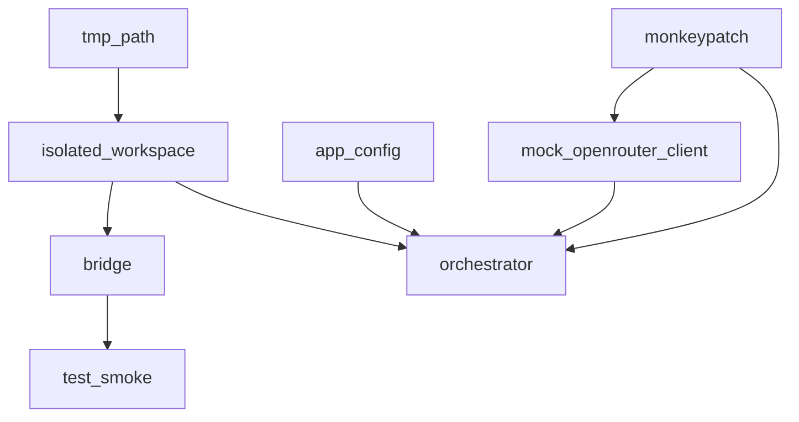

# Implementation Plan: APP-049 — Create `app/tests/` package

**Ticket:** APP-049  
**Spec:** [`spec.md`](spec.md) (QA PASS round 2)  
**Domain spec:** [`tmp/app-logging-qa-spec.md`](../../../app-logging-qa-spec.md) — changelog **on ticket close only** (not during impl)  
**Scope:** Five paths only (four new under `app/tests/`, domain spec at release)

---

## Summary

Create a pytest package at `app/tests/` runnable from **repo root** with centralized `sys.path` setup, engine-parity isolated workspaces, shared fixtures (`bridge`, `app_config`, `mock_openrouter_client`, `orchestrator`), and one smoke test exercising the `bridge` fixture. No production code changes. No behavioral/orchestrator-turn tests in this ticket.

---

## Preconditions

- Ticket claimed: `python tmp/backlog/claim_ticket.py APP-049 --task create-app-tests-package`
- `pytest` available in the active Python env (not pinned in `app/requirements.txt` — APP-050; assume dev env has it)
- Cwd for all gates: **repository root**

---

## File-by-file plan

### 1. `app/tests/__init__.py`

| Action | Detail |
|--------|--------|
| Create | Empty file or single comment `# Tomb Dust app pytest package` |
| Purpose | Package marker for discovery when running `python -m pytest app/tests` |

No imports in this file (keeps collection clean).

---

### 2. `app/tests/helpers.py`

Mirror [`play/tomb_gm/tests/helpers.py`](../../../../play/tomb_gm/tests/helpers.py) contract with **correct depth**:

| Symbol | Value / behavior |
|--------|----------------|
| `REPO` | `Path(__file__).resolve().parents[2]` — **not** `parents[3]` (engine uses `parents[3]`) |
| `APP` | `REPO / "app"` |
| `PLAY` | `REPO / "play"` |
| `BUILD` | `REPO / "build"` |
| `make_isolated_workspace(base: Path) -> Path` | Copy engine implementation verbatim: mkdir `base/workspace`, `campaigns/`, write `config.yaml` with `content_root` = relative path to `BUILD`, `local_dir: .local`, `max_players: 4` |

**Do not import** from `play/tomb_gm/tests/helpers.py` — keep trees independent per spec.

**Out of scope for APP-049 (optional later):** `utc_now`, `seed_campaign` — not required by ticket AC; add only if a fixture needs them in APP-057.

---

### 3. `app/tests/conftest.py`

#### 3a. Module-level `sys.path` (R2) — runs before fixtures

At top of file (after `from __future__` if used):

1. Import `REPO`, `APP`, `PLAY`, `BUILD`, `make_isolated_workspace` from `helpers` (pytest adds `app/tests` to path like engine conftest).
2. For each path in `(APP, PLAY, REPO / "build" / "tools")`:
   - `s = str(p)`
   - If `s not in sys.path`: `sys.path.insert(0, s)`

**Verification intent:** From repo root, `import gm.bridge` and `import tomb_gm.config` succeed without `cd app`.

**Contrast with `app/main.py`:** `main.py` inserts `play/` and `build/tools/` only; cwd is typically `app/`. App tests must explicitly add `REPO/app` because cwd is repo root.

#### 3b. Fixture: `isolated_workspace` (function)

```text
@pytest.fixture
def isolated_workspace(tmp_path: Path) -> Path:
    return make_isolated_workspace(tmp_path)
```

Never reference `PLAY / "workspace"` or `DEFAULT_WORKSPACE`.

#### 3c. Fixture: `bridge` (function)

```text
Depends: isolated_workspace

1. Lazy-import: from gm.bridge import GameBridge  (after sys.path setup)
2. bridge = GameBridge(workspace=isolated_workspace)
3. bridge.init()  # migrations + campaigns dir; touches tmp only
4. yield bridge
5. Teardown: bridge.ctx.conn.close()
```

`GameBridge` has no `.close()` — use `ctx.conn` ([`app/gm/bridge.py`](../../../../app/gm/bridge.py) stores connection on `CommandContext`).

#### 3d. Fixture: `app_config` (function recommended)

```text
1. import yaml
2. Read APP / "config.yaml" with utf-8
3. return yaml.safe_load(f) or {}
```

Match [`app/main.py`](../../../../app/main.py) `load_config()` shape (llm/tts/ui keys). **Function scope** — read-only but consistent with other function fixtures.

#### 3e. Fixture: `mock_openrouter_client` (function)

**Patch target:** `gm.orchestrator.create_client` — **not** `gm.openrouter.create_client`.

**Rationale (code):** [`app/gm/orchestrator.py:45`](../../../../app/gm/orchestrator.py) binds `from gm.openrouter import create_client`; `Orchestrator.__init__` calls `create_client()` at line 82. Patching only the openrouter module after orchestrator import leaves the bound reference stale.

**Stub shape (minimal, no API key):**

- Return object with `.chat.completions.create(**kwargs)` 
- Response: `.choices[0].message` with `content` str (e.g. `"Test narration."`), `tool_calls` None/empty
- `.choices[0].finish_reason == "stop"`

Use simple nested classes or `types.SimpleNamespace` — no network, no `OPENROUTER_API_KEY`.

```python
monkeypatch.setattr("gm.orchestrator.create_client", _stub_factory)
yield stub_client  # optional, for tests that assert on client
```

**Import-order rule (mandatory):** This fixture must be applied before any code imports `gm.orchestrator` or constructs `Orchestrator`. No file under `app/tests/**` may contain module-level `from gm.orchestrator import Orchestrator`.

#### 3f. Fixture: `orchestrator` (function) — workspace-safe

**Depends on:** `app_config`, `isolated_workspace`, `mock_openrouter_client`, `monkeypatch`

**Forbidden:** Yielding while `orchestrator.bridge` resolves to `play/workspace` (`DEFAULT_WORKSPACE` in [`play/tomb_gm/config.py:12`](../../../../play/tomb_gm/config.py)).

**Preferred pattern (implement this):**

Before lazy-importing `Orchestrator`, patch the name `GameBridge` **in the orchestrator module namespace**:

```python
def _orchestrator_game_bridge(workspace=None):
    from gm.bridge import GameBridge
    return GameBridge(workspace=workspace if workspace is not None else isolated_workspace)

monkeypatch.setattr("gm.orchestrator.GameBridge", _orchestrator_game_bridge)
```

Then:

```python
from gm.orchestrator import Orchestrator  # inside fixture body only
orch = Orchestrator(app_config)
assert orch.bridge.ctx.config.workspace.resolve() == isolated_workspace.resolve()
yield orch
# teardown: orch.bridge.ctx.conn.close()
```

`Orchestrator()` calls `GameBridge()` with no args → patched callable returns isolated bridge. **No** `play/workspace` SQLite open.

**Minimum pattern (document only — do not use unless preferred fails):**

1. Construct stock `Orchestrator(app_config)` after `mock_openrouter_client` (default `GameBridge()` may open `play/workspace`).
2. Immediately: `default = orch.bridge`; `orch.bridge = GameBridge(workspace=isolated_workspace)`; `default.ctx.conn.close()`.
3. Never call `process_turn` / session methods before swap.
4. Teardown: close `orch.bridge.ctx.conn`.

Add one-line docstring in conftest noting residual risk if minimum pattern is ever used.

**Out of scope:** Constructor/workspace injection on `Orchestrator` (non-goal).

---

### 4. `app/tests/test_smoke.py`

| Item | Detail |
|------|--------|
| Test name | `test_bridge_status_after_init` |
| Fixture | `bridge` only (no `orchestrator` — avoids OpenRouter/orchestrator path in smoke) |
| Assertions | `status = bridge.status()` → `isinstance(status, dict)`; `"roster" in status`; `isinstance(status["roster"], list)` |
| Docstring | Note: scaffolding validation for APP-049; not behavioral coverage |

**Do not** module-import `Orchestrator` or `gm.orchestrator`.

Empty collection → pytest exit code 5; this file prevents that (R4).

---

### 5. `tmp/app-logging-qa-spec.md` (close only)

| When | Action |
|------|--------|
| During implementation | **Do not edit** |
| On `release APP-049 --done` | Mark § Task checklist APP-049 `[x]`; append changelog row: implementation landed, smoke test, fixture table verified |

---

## Fixture dependency graph



---

## Implementation order

1. `helpers.py` — path constants + `make_isolated_workspace` (enables manual sanity import)
2. `conftest.py` — sys.path block, then `isolated_workspace`, `bridge`, `app_config`
3. `test_smoke.py` — run pytest; should pass with bridge-only fixtures
4. `conftest.py` — add `mock_openrouter_client`, `orchestrator` (not used by smoke but required R3)
5. Re-run full `app/tests` + engine regression
6. Domain spec + ticket close at release (separate step)

---

## Test commands

```bash
# Primary gate (repo root)
python -m pytest app/tests -q

# Expect: ≥1 test collected, exit 0, no failures

# Regression — engine suite unchanged
python -m pytest play/tomb_gm/tests -q

# Optional sanity (no code change expected)
cd app && python main.py
```

**Post-implementation checks:**

- [ ] `python -m pytest app/tests -q` exit 0
- [ ] Smoke test uses isolated tmp workspace (no new files under `play/workspace` after run)
- [ ] `import gm.orchestrator` does not occur at collection time in `test_smoke.py` / `__init__.py`
- [ ] Engine suite still green

**Workspace pollution check (manual):**

```bash
# Before/after mtime or git status on play/workspace — should be unchanged by app/tests run
git status -- play/workspace
```

---

## Risks and mitigations

| Risk | Severity | Mitigation |
|------|----------|------------|
| Wrong `REPO` depth (`parents[3]`) | High — breaks imports | Code review: `parents[2]` only; comment referencing engine `parents[3]` |
| Module-level `import gm.orchestrator` in tests | High — real API key / wrong `create_client` | Lint by convention; lazy-import inside fixtures only |
| Patch `gm.openrouter.create_client` only | High — Orchestrator still hits real API | Patch `gm.orchestrator.create_client` per spec |
| `Orchestrator.__init__` opens `play/workspace` | High — player save risk | Preferred `GameBridge` monkeypatch on `gm.orchestrator.GameBridge` |
| Minimum swap pattern briefly touches `play/workspace` | Medium | Prefer factory patch; document in conftest if fallback used |
| `GameBridge` DB connections leak | Low | `bridge` and `orchestrator` fixtures close `ctx.conn` in teardown |
| `bridge.init()` on fresh workspace | Low | Same as engine pattern; only tmp path |
| JSONL writes to `app/logs/` during future orchestrator tests | Low | Out of scope APP-049; APP-051/057 may add `LOG_DIR` monkeypatch later |
| `pytest` missing in env | Medium | Document in human-test-plan; APP-050 for CI pin |
| Stub `OpenAI` response too minimal for APP-057 | Low | APP-049 stub only needs `content` + empty tools; extend in APP-051 |

---

## Downstream handoff (no work in APP-049)

| Ticket | Extension |
|--------|-----------|
| APP-057 | `test_creation_flow.py` — uses `orchestrator` fixture; extend conftest only if new shared fixture needed |
| APP-051 | Mock LLM response helpers / golden path under `app/tests/` |
| APP-054 | Full app suite green gate once more tests exist |

---

## Acceptance mapping (Dev self-check)

| Req | Deliverable |
|-----|-------------|
| R1 | `__init__.py`, `helpers.py` (`parents[2]`, `APP`, `make_isolated_workspace`), `conftest.py` loads |
| R2 | conftest inserts `REPO/app`, `REPO/play`, `REPO/build/tools` |
| R3 | All five fixtures + import-order + orchestrator workspace safety |
| R4 | `test_smoke.py` + pytest exit 0 |

---

## Out of scope (explicit)

- `Orchestrator` / `GameBridge` API changes
- `pytest.ini`, CI workflow, `requirements.txt` pytest pin
- `LOG_DIR` monkeypatch
- `run_tomb_gm` CLI subprocess fixtures
- Behavioral tests (creation, golden path, turn loop)
- Domain spec changelog until ticket release
