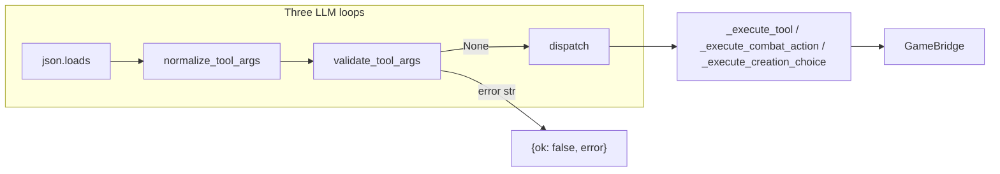

# Dev Plan: APP-080-normalize-tool-args

**backlog_ticket:** APP-080  
**run-folder:** `tmp/backlog/runs/app-080-normalize-tool-args/`  
**Inputs:** [research-brief.md](./research-brief.md), [spec.md](./spec.md), [qa-spec-pass.md](./qa-spec-pass.md), [ticket](../../app-080-normalize-tool-args-before-dispatch.md), domain specs  
**Stage:** Dev plan (pre-implementation)

## Summary

Add `app/gm/tool_args.py` as the single boundary between `json.loads` and `GameBridge` dispatch. Coerce fragile scalars (especially `remember_fact.importance`), strip tool/XML markup bleed, whitelist kwargs per v1 tool, and validate required fields **before** `_execute_tool` so Holt-style `TypeError` never becomes a silent `{ok: false}` that the LLM abandons for a different tool.

**Primary regression:** session 2026-05-20 — `importance: "4</importance>…<invoke name=\"enter_dungeon\">…"` → `semantic.remember` clamp `TypeError` → quest fact lost.

---

## Files (implementation scope ⊆ ticket Expected files)

| File | Action |
|------|--------|
| `app/gm/tool_args.py` | **New** — helpers, whitelist, normalize, validate |
| `app/gm/orchestrator.py` | Wire normalize+validate at three `json.loads` sites; remove ad-hoc `enter_dungeon` rewrite |
| `app/tests/test_tool_args.py` | **New** — unit + one integration-style `_execute_tool` test |
| `tmp/app-llm-orchestrator-spec.md` | On close: promote draft § to done, failure-mode validator row, changelog |
| `tmp/app-gamebridge-spec.md` | On close: confirm typed-args cross-link (already drafted 2026-05-21) |

No other paths in this ticket.

---

## Architecture



### Module: `app/gm/tool_args.py`

| Symbol | Responsibility |
|--------|----------------|
| `_strip_tool_markup(s: str) -> str` | Cut at first `</invoke>`, `</parameter>`, `<invoke`, `<parameter`; trim whitespace |
| `_coerce_int(value, default, *, min_v, max_v) -> int` | `str` → markup strip → leading-digit regex; invalid → `default`; clamp |
| `_coerce_str(value, default="") -> str` | `str()` + markup strip on strings |
| `_coerce_str_list(value) -> list[str]` | `list` → filter `str`; single `str` → `[str]`; else `[]` |
| `_ALLOWED_KEYS: dict[str, frozenset[str]]` | Per-tool kwargs whitelist (SPEC-002) |
| `normalize_tool_args(tool_name: str, args: dict) -> dict` | Coerce + alias + drop unknown keys; **never raises** |
| `validate_tool_args(tool_name: str, args: dict) -> str \| None` | Returns `"<field> required"` or `None` (SPEC-001) |

**Validation placement (SPEC-001):** Required-field checks live in `validate_tool_args` in `tool_args.py`, **not** in bridge or `_execute_tool` except the existing tool-name routing. Orchestrator loops call validate **after** normalize and **before** dispatch; on non-`None` error string, set `result = {"ok": False, "error": err}` and skip `_execute_tool` / combat / creation handlers.

**Do not** fold validation into `normalize_tool_args` return type (keeps normalize pure for unit tests). **Do not** rely on bridge `TypeError` for v1 required fields.

Optional APP-034 telemetry: `log_tool_arg_coerced` helper in `tool_args.py` calling `logger` only when raw ≠ coerced — defer if it adds noise without APP-034 coordination; not blocking.

---

## Allowed-key whitelist (SPEC-002)

Drop any key not in the tool’s frozenset **after** coercions/aliases. Source of truth: `tools.py` required/optional + bridge `**kwargs` signatures for v1 table.

| `tool_name` | Allowed keys (output of normalize) |
|-------------|-----------------------------------|
| `remember_fact` | `fact`, `entities`, `importance` |
| `memory_recall` | `query`, `top_k` only (legacy `top` consumed during normalize) |
| `fortune_spend` | `character_id` |
| `clock_tick` | `clock`, `segments` |
| `enter_dungeon` | `site_address` only (`site_id` migrated, then removed) |
| `set_creation_choice` | `step`, `value` |
| `combat_action` | `action`, `actor_id`, `target_id`, `weapon_id`, `spell_id` |

Unknown tool names: pass args through unchanged (no whitelist) so `_execute_tool` can still return `Unknown tool`. v1 whitelist applies only to the six coercion-table tools + creation/combat loop tools.

---

## Tool-specific normalize rules

### `remember_fact`

1. `fact` ← `_coerce_str(args.get("fact"), "")` — no markup strip on long prose in v1.
2. `entities` ← `_coerce_str_list(args.get("entities"))`.
3. `importance` ← `_coerce_int(args.get("importance", 3), 3, min_v=1, max_v=5)` with markup strip on string input first.
4. Whitelist to three keys.

### `memory_recall` — `top` / `top_k` precedence (SPEC-005)

1. If `top_k` present (any type): use it as canonical after coerce.
2. Else if legacy `top` present: copy to `top_k`.
3. If **both** present: **`top_k` wins**; ignore `top` (document in spec + one unit test).
4. `query` ← `_coerce_str(..., "")`; `top_k` ← `_coerce_int(..., 5, min_v=1, max_v=10_000)` (no upper cap in bridge; use large max_v for clamp safety only).
5. Drop `top` from output dict.

### `fortune_spend`

- `character_id` ← `_coerce_str` + markup strip; drop `amount` and all other keys.

### `clock_tick`

- `clock` ← `_coerce_str`; `segments` ← `_coerce_int(..., 1, min_v=1, max_v=100)`.

### `enter_dungeon`

- If `site_address` missing and `site_id` present: `site_address = _coerce_str(site_id)`.
- Else `site_address = _coerce_str(site_address or site_id or "")`.
- Output only `site_address` (remove `site_id`). Migrate logic from `orchestrator.py` ~2086–2090.

### `set_creation_choice` (creation loop)

- `step`, `value` ← `_coerce_str`; whitelist two keys.

### `combat_action` (combat loop)

- String-coerce all present keys; whitelist five keys; no ints in schema.

### Default branch

- For whitelisted tools above: run table branch.
- Else: return `dict(args)` shallow copy (future tools unchanged).

---

## Validate rules (required fields)

| Tool | `validate_tool_args` returns |
|------|------------------------------|
| `remember_fact` | `"fact required"` if `not args.get("fact", "").strip()` |
| `memory_recall` | `"query required"` if empty query |
| `fortune_spend` | `"character_id required"` if empty |
| `clock_tick` | `"clock required"` if empty |
| `enter_dungeon` | `"site_address required"` if empty (post-alias) |
| `set_creation_choice` | `"step required"` / `"value required"` as appropriate |
| `combat_action` | `"action required"` / `"actor_id required"` |
| Other | `None` (dispatch handles) |

**`JSONDecodeError` → `{}`:** After normalize+validate, `remember_fact` with `{}` → validate returns `"fact required"` → loop gets structured error without bridge call.

---

## Orchestrator wiring (SPEC-003 — all three loops mandatory)

Shared inline pattern (extract tiny local helper only if duplication hurts readability; prefer copy-paste 3× to avoid new orchestrator API):

```python
args = json.loads(...)
except JSONDecodeError:
    args = {}
args = normalize_tool_args(fn_name, args)
if err := validate_tool_args(fn_name, args):
    result = {"ok": False, "error": err}
else:
    result = ...  # existing dispatch
```

### Site 1 — `_creation_llm_loop` (~1493–1507)

| Step | Current | After APP-080 |
|------|---------|---------------|
| Parse | `json.loads` → `{}` on error | unchanged |
| Normalize | none | `normalize_tool_args("set_creation_choice", args)` |
| Validate | implicit in `_execute_creation_choice` | `validate_tool_args` before handler |
| Dispatch | `_execute_creation_choice(step, value, ...)` | same; args already coerced strings |

Creation does not use `_execute_tool`; symmetry still required by ticket AC and domain wire table.

### Site 2 — `_combat_llm_loop_inner` (~1831–1840)

| Step | Current | After APP-080 |
|------|---------|---------------|
| Parse | `json.loads` | unchanged |
| Normalize | none | `normalize_tool_args("combat_action", args)` |
| Validate | none | before `_execute_combat_action(**args)` |
| Dispatch | `**args` | unchanged signature |

### Site 3 — `_llm_loop` (~1969–1976) — **critical path**

| Step | Current | After APP-080 |
|------|---------|---------------|
| Parse | `json.loads` | unchanged |
| Normalize | none | `normalize_tool_args(fn_name, args)` |
| Validate | none | before `_execute_tool(fn_name, args)` |
| Dispatch | `_execute_tool` | unchanged |

**Remove** `enter_dungeon` `site_id` rewrite block in `_execute_tool` (~2086–2090); rely on normalizer.

**Log lines:** `log_tool_call(fn_name, args, result)` should log **post-normalize** args (easier debugging; document in spec).

**Out of scope:** `_remember_player_choice` (~620) — orchestrator-internal, already typed `int`; no `json.loads`.

---

## Deep code-path traces

### A. Holt regression (exploration) — failure

```
process_turn → _llm_loop(depth=0)
  → chat_completion → tool_calls[remember_fact]
  → json.loads(arguments)  # ~1972, raw importance str
  → _execute_tool("remember_fact", args)  # no normalize
    → bridge.remember_fact(**args)
      → semantic.remember → max(1, min(5, importance))  # TypeError
    → except → {ok: false, error: "'<' not supported..."}
  → system TOOL FAILED message
  → _llm_loop(depth=1) → enter_dungeon only → ok
  → tool_impact_fact → generic room fact (not quest text)
```

### B. Holt regression — fixed path

```
_llm_loop
  → json.loads
  → normalize_tool_args("remember_fact", args)
      importance: "4</importance>..." → 4
  → validate_tool_args → None
  → _execute_tool → bridge.remember_fact → semantic.remember → ok
  → no erroneous retry; quest fact persisted
```

### C. `memory_recall` string `top_k`

```
_execute_tool → bridge.memory_recall(**args)
  → recall_facts(..., top=top_k)
  → semantic.recall → scored[:top]  # TypeError if top is str
```

Fix: normalize `top_k` to `int` ≥ 1; legacy `top` alias; precedence rule above.

### D. `fortune_spend` spurious `amount`

```
LLM sends {character_id, amount: "2"}
  → bridge.fortune_spend(**args)  # unexpected keyword if amount passed
```

Fix: whitelist drops `amount`; coerce `character_id` only.

### E. `enter_dungeon` ad-hoc alias (today)

```
_execute_tool enter_dungeon branch:
  if site_id and not site_address: site_address = pop(site_id)
```

Fix: move to `normalize_tool_args`; delete branch.

### F. Creation / combat (symmetry)

- Creation: only `set_creation_choice`; risk = empty `step`/`value` strings after bad JSON — validate returns structured error.
- Combat: `combat_action` string fields; whitelist prevents stray LLM keys breaking `**kwargs`.

---

## Implementation order

1. **`tool_args.py`** — helpers, `_ALLOWED_KEYS`, `normalize_tool_args`, `validate_tool_args` (TDD: tests first or alongside).
2. **`test_tool_args.py`** — unit matrix below; green before orchestrator touch.
3. **`orchestrator.py`** — three wire sites + remove `enter_dungeon` rewrite.
4. **Re-run** `cd app && python -m pytest tests/ -q`.
5. **Spec sync on close** — changelog entries in both domain specs; ticket `release --done`.

---

## Test plan (`app/tests/test_tool_args.py`)

### Fixtures

- `HOLT_CORRUPTED_IMPORTANCE` — copy from ticket/session: `"4</importance>\n</invoke>\n<invoke name=\"enter_dungeon\">..."`
- `HOLT_REMEMBER_FACT_ARGS` — valid `fact` + `entities` + corrupted `importance`

### Unit — helpers

| Test | Assert |
|------|--------|
| `test_coerce_int_markup_prefix` | `"4</importance>..."` → `4` |
| `test_coerce_int_invalid` | `"abc"` → default `3` |
| `test_strip_tool_markup_truncates_invoke_tail` | tail after `</invoke>` removed |

### Unit — normalize

| Test | Assert |
|------|--------|
| `test_normalize_remember_fact_corrupted_importance` | `importance` is `int` 4; entities list[str] |
| `test_normalize_remember_fact_no_typeerror_via_semantic` | normalize then call `semantic.remember` with coerced dict fields (in-memory sqlite or mock) |
| `test_normalize_memory_recall_top_k_string` | `"5"` → `5` |
| `test_normalize_memory_recall_legacy_top` | `top: "3"` → `top_k: 3`, no `top` key |
| `test_normalize_memory_recall_top_k_wins_over_top` | both present → `top_k` coerced value kept |
| `test_normalize_fortune_spend_drops_amount` | only `character_id` |
| `test_normalize_enter_dungeon_site_id_alias` | `site_id` only → `site_address` str; no `site_id` |
| `test_normalize_clock_tick_segments_string` | `"2"` → `2` |

### Unit — validate (SPEC-001)

| Test | Assert |
|------|--------|
| `test_validate_remember_fact_missing_fact` | `{}` after normalize → `"fact required"` |
| `test_validate_memory_recall_missing_query` | `"query required"` |
| `test_validate_fortune_spend_missing_character_id` | `"character_id required"` |

### Integration

| Test | Assert |
|------|--------|
| `test_execute_tool_remember_fact_corrupted_importance_ok` | Minimal `Orchestrator` or patch bridge: `_execute_tool("remember_fact", raw_args)` with Holt fixture → `{ok: True}` when bridge mocked or sqlite campaign fixture |

Use patterns from `test_creation_flavor_sanitize.py` / `test_creation_flow.py` for orchestrator construction; avoid gitignored session JSONL.

**Defer (documented, not v1):** stringified JSON array for `entities` (SPEC-008); full orchestrator `_llm_loop` mock chain (optional if `_execute_tool` test suffices).

---

## Spec sync on close (not in impl PR unless behavior delta)

| Doc | Update |
|-----|--------|
| `tmp/app-llm-orchestrator-spec.md` | Add `validate_tool_args` to Helpers table; `top_k` precedence bullet; wire step “validate before dispatch”; mark APP-080 checklist done; changelog dated close |
| `tmp/app-gamebridge-spec.md` | Confirm § Typed args (already present); no bridge code changes |
| `tmp/app-master-spec.md` | Owns column: add `tool_args.py` (SPEC-006, on close) |

---

## Risks and mitigations

| Risk | Mitigation |
|------|------------|
| Markup strip damages legitimate `fact` prose | v1: scalars only; no strip on `fact` |
| `log_tool_call` shows coerced args only | Acceptable; note in spec; raw in LLM transcript still exists |
| Whitelist too aggressive on unlisted tools | Whitelist only v1 table + creation/combat; passthrough otherwise |
| Dual `top`/`top_k` | Document `top_k` wins; test |

---

## QA spec notes addressed

| Note | Plan resolution |
|------|-----------------|
| SPEC-001 validation placement | `validate_tool_args` in `tool_args.py`; loops short-circuit before dispatch; negative tests added |
| SPEC-002 unknown-key whitelist | `_ALLOWED_KEYS` table above; enforced in `normalize_tool_args` |
| SPEC-003 creation optional wording | All three loops **mandatory** in this plan |
| SPEC-004 domain vs run test drift | Include `enter_dungeon` + `clock_tick` unit tests (run spec matrix) |
| SPEC-005 top/top_k precedence | `top_k` wins; dedicated test |
| SPEC-006 registry Owns | Master spec row on ticket close |
| SPEC-007 backlog README | Cosmetic; optional on close |
| SPEC-008 entities JSON string | Out of v1; follow-up if logs show it |

---

## Definition of done

- [ ] `pytest tests/test_tool_args.py` green
- [ ] `pytest tests/` green (no regressions)
- [ ] Holt fixture: `remember_fact` no `TypeError`; `{ok: true}` on integration test
- [ ] Three loops wired; `enter_dungeon` ad-hoc rewrite removed
- [ ] Domain specs + ticket released per backlog process
